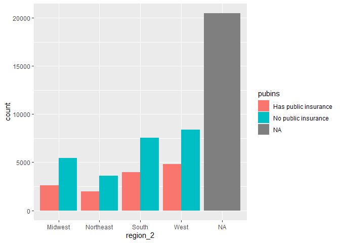
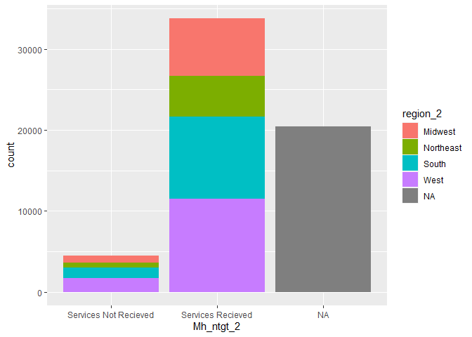

Midterm
================
Camille Parchment
2022-10-21

``` r
library(data.table)
library(tidyverse)
```

    ## ── Attaching packages ─────────────────────────────────────── tidyverse 1.3.2 ──
    ## ✔ ggplot2 3.3.6     ✔ purrr   0.3.4
    ## ✔ tibble  3.1.8     ✔ dplyr   1.0.9
    ## ✔ tidyr   1.2.0     ✔ stringr 1.4.1
    ## ✔ readr   2.1.2     ✔ forcats 0.5.2
    ## ── Conflicts ────────────────────────────────────────── tidyverse_conflicts() ──
    ## ✖ dplyr::between()   masks data.table::between()
    ## ✖ dplyr::filter()    masks stats::filter()
    ## ✖ dplyr::first()     masks data.table::first()
    ## ✖ dplyr::lag()       masks stats::lag()
    ## ✖ dplyr::last()      masks data.table::last()
    ## ✖ purrr::transpose() masks data.table::transpose()

``` r
pulse18 <- fread("pulse2020_puf_18.csv")
```

``` r
MHdf <- subset(pulse18, select = c(SCRAM, TBIRTH_YEAR, MS, MH_SVCS, MH_NOTGET, EGENDER, ANYWORK, HLTHINS1, HLTHINS2, HLTHINS3, HLTHINS4, HLTHINS5, HLTHINS6, HLTHINS7, HLTHINS8))
```

``` r
pulse18[pulse18$MH_NOTGET == -88] <- NA
pulse18[pulse18$MH_NOTGET == -99] <- NA
pulse18[pulse18$MH_SVCS == -88] <- NA
pulse18[pulse18$MH_SVCS == -99] <- NA
pulse18[pulse18$MS == -88] <- NA
pulse18[pulse18$MS == -99] <- NA
pulse18[pulse18$ANYWORK == -88] <- NA
pulse18[pulse18$ANYWORK == -99] <- NA
pulse18[pulse18$HLTHINS1 == -88] <- NA
pulse18[pulse18$HLTHINS1 == -99] <- NA
pulse18[pulse18$HLTHINS2 == -88] <- NA
pulse18[pulse18$HLTHINS2 == -99] <- NA
pulse18[pulse18$HLTHINS3 == -88] <- NA
pulse18[pulse18$HLTHINS3 == -99] <- NA
pulse18[pulse18$HLTHINS4 == -88] <- NA
pulse18[pulse18$HLTHINS4 == -99] <- NA
pulse18[pulse18$HLTHINS5 == -88] <- NA
pulse18[pulse18$HLTHINS5 == -99] <- NA
pulse18[pulse18$HLTHINS6 == -88] <- NA
pulse18[pulse18$HLTHINS6 == -99] <- NA
pulse18[pulse18$HLTHINS7 == -88] <- NA
pulse18[pulse18$HLTHINS7 == -99] <- NA
pulse18[pulse18$HLTHINS8 == -88] <- NA
pulse18[pulse18$HLTHINS8 == -99] <- NA
```

``` r
summary(pulse18$HLTHINS1)
```

    ##    Min. 1st Qu.  Median    Mean 3rd Qu.    Max.    NA's 
    ##   1.000   1.000   1.000   1.338   2.000   2.000   20469

``` r
MHdf_2 <- subset(pulse18, select = c(SCRAM, REGION, PUBHLTH, PRIVHLTH, EST_ST, TBIRTH_YEAR, MS, MH_SVCS, MH_NOTGET, EGENDER, ANYWORK, HLTHINS1, HLTHINS2, HLTHINS3, HLTHINS4, HLTHINS5, HLTHINS6, HLTHINS7, HLTHINS8 ))
```

``` r
pulse18[pulse18$MH_NOTGET == -88] <- NA
pulse18[pulse18$MH_NOTGET == -99] <- NA
pulse18[pulse18$MH_SVCS == -88] <- NA
pulse18[pulse18$MH_SVCS == -99] <- NA
pulse18[pulse18$MS == -88] <- NA
pulse18[pulse18$MS == -99] <- NA
pulse18[pulse18$ANYWORK == -88] <- NA
pulse18[pulse18$ANYWORK == -99] <- NA
pulse18[pulse18$HLTHINS1 == -88] <- NA
pulse18[pulse18$HLTHINS1 == -99] <- NA
pulse18[pulse18$HLTHINS2 == -88] <- NA
pulse18[pulse18$HLTHINS2 == -99] <- NA
pulse18[pulse18$HLTHINS3 == -88] <- NA
pulse18[pulse18$HLTHINS3 == -99] <- NA
pulse18[pulse18$HLTHINS4 == -88] <- NA
pulse18[pulse18$HLTHINS4 == -99] <- NA
pulse18[pulse18$HLTHINS5 == -88] <- NA
pulse18[pulse18$HLTHINS5 == -99] <- NA
pulse18[pulse18$HLTHINS6 == -88] <- NA
pulse18[pulse18$HLTHINS6 == -99] <- NA
pulse18[pulse18$HLTHINS7 == -88] <- NA
pulse18[pulse18$HLTHINS7 == -99] <- NA
pulse18[pulse18$HLTHINS8 == -88] <- NA
pulse18[pulse18$HLTHINS8 == -99] <- NA
```

``` r
ins1_empl <- ifelse(MHdf$HLTHINS1 == "1", 1,0)
ins2_markt <- ifelse(MHdf$HLTHINS2 == "1", 1,0)
ins3_medicare <- ifelse(MHdf$HLTHINS3 == "1", 1,0)
ins4_medicaid <- ifelse(MHdf$HLTHINS4 == "1", 1,0)
ins5_tricare <- ifelse(MHdf$HLTHINS5 == "1", 1,0)
ins6_va <- ifelse(MHdf$HLTHINS6 == "1", 1,0)
ins7_indian <- ifelse(MHdf$HLTHINS7 == "1", 1,0)
ins8_other <- ifelse(MHdf$HLTHINS8 == "1", 1,0)
```

``` r
MHdf_2[MHdf_2$PUBHLTH == 3] <- NA
MHdf_2[MHdf_2$PRIVHLTH == 3] <- NA
```

``` r
pubins <- ifelse(MHdf_2$PUBHLTH == "1", "Has public insurance", "No public insurance")
privins <- ifelse(MHdf_2$PRIVHLTH == "1", "Has Private insuracne","No private insurance")
```

``` r
library(ggplot2)
```

``` r
region_2 <- ifelse(MHdf_2$REGION == "1", "Northeast",
            ifelse(MHdf_2$REGION == "2", "South",
            ifelse(MHdf_2$REGION == "3", "Midwest", "West")))
```

``` r
table(region_2)
```

    ## region_2
    ##   Midwest Northeast     South      West 
    ##      8025      5566     11505     13164

``` r
head(region_2)
```

    ## [1] "South" NA      "South" "South" "South" "South"

``` r
MH_sum <- sum(MHdf_2$MH_NOTGET, na.rm = TRUE)
```

``` r
table(ins1_empl
    )
```

    ## ins1_empl
    ##     0     1 
    ## 26671 32058

``` r
prop.table(table(ins1_empl))
```

    ## ins1_empl
    ##         0         1 
    ## 0.4541368 0.5458632

``` r
table(ins2_markt)/length(ins2_markt)
```

    ## ins2_markt
    ##         0         1 
    ## 0.8091233 0.1908767

``` r
sd(ins1_empl)
```

    ## [1] 0.4978964

``` r
ggplot(MHdf_2, aes(x= region_2, fill = privins)) + geom_bar(position = position_dodge())
```

<!-- -->

``` r
ggplot(MHdf_2, aes(x= region_2, fill = pubins, na.rm= TRUE)) + geom_bar(position = position_dodge())
```

<!-- -->

``` r
Mh_ntgt_2 <- ifelse(MHdf_2$MH_NOTGET == "1", "Services Not Recieved", "Services Recieved")
Mh_svs_2 <- ifelse(MHdf_2$PUBHLTH == "1", "Recieved services", "No Services")
```

``` r
ggplot(MHdf_2, aes(x= Mh_ntgt_2, fill = region_2)) + geom_bar () 
```

<!-- -->

``` r
ggplot(MHdf_2, aes(x= Mh_ntgt_2, fill = privins)) + geom_bar(position = position_dodge())
```

<!-- -->

``` r
summary(MHdf)
```

    ##     SCRAM            TBIRTH_YEAR         MS             MH_SVCS      
    ##  Length:58729       Min.   :1932   Min.   :-99.000   Min.   :-99.00  
    ##  Class :character   1st Qu.:1955   1st Qu.:  1.000   1st Qu.:  1.00  
    ##  Mode  :character   Median :1968   Median :  1.000   Median :  2.00  
    ##                     Mean   :1968   Mean   :  1.309   Mean   :-13.63  
    ##                     3rd Qu.:1981   3rd Qu.:  3.000   3rd Qu.:  2.00  
    ##                     Max.   :2002   Max.   :  5.000   Max.   :  2.00  
    ##    MH_NOTGET         EGENDER         ANYWORK            HLTHINS1     
    ##  Min.   :-99.00   Min.   :1.000   Min.   :-99.0000   Min.   :-99.00  
    ##  1st Qu.:  1.00   1st Qu.:1.000   1st Qu.:  1.0000   1st Qu.:  1.00  
    ##  Median :  2.00   Median :2.000   Median :  1.0000   Median :  1.00  
    ##  Mean   :-13.55   Mean   :1.596   Mean   :  0.8205   Mean   :-16.33  
    ##  3rd Qu.:  2.00   3rd Qu.:2.000   3rd Qu.:  2.0000   3rd Qu.:  2.00  
    ##  Max.   :  2.00   Max.   :2.000   Max.   :  2.0000   Max.   :  2.00  
    ##     HLTHINS2        HLTHINS3         HLTHINS4         HLTHINS5     
    ##  Min.   :-99.0   Min.   :-99.00   Min.   :-99.00   Min.   :-99.00  
    ##  1st Qu.:-88.0   1st Qu.:  1.00   1st Qu.:-88.00   1st Qu.:-88.00  
    ##  Median :  2.0   Median :  2.00   Median :  2.00   Median :  2.00  
    ##  Mean   :-22.7   Mean   :-20.55   Mean   :-24.58   Mean   :-25.13  
    ##  3rd Qu.:  2.0   3rd Qu.:  2.00   3rd Qu.:  2.00   3rd Qu.:  2.00  
    ##  Max.   :  2.0   Max.   :  2.00   Max.   :  2.00   Max.   :  2.00  
    ##     HLTHINS6         HLTHINS7         HLTHINS8     
    ##  Min.   :-99.00   Min.   :-99.00   Min.   :-99.00  
    ##  1st Qu.:-88.00   1st Qu.:-88.00   1st Qu.:-88.00  
    ##  Median :  2.00   Median :  2.00   Median :  2.00  
    ##  Mean   :-25.38   Mean   :-26.09   Mean   :-28.64  
    ##  3rd Qu.:  2.00   3rd Qu.:  2.00   3rd Qu.:  2.00  
    ##  Max.   :  2.00   Max.   :  2.00   Max.   :  2.00
