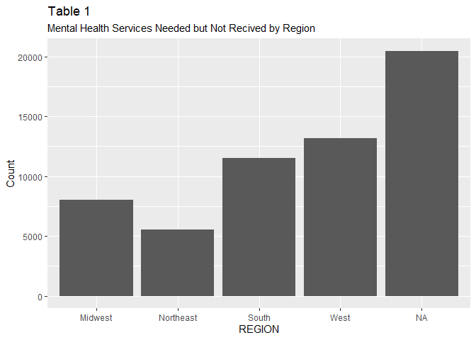
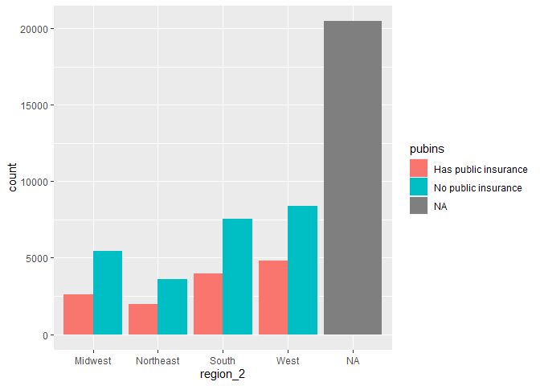
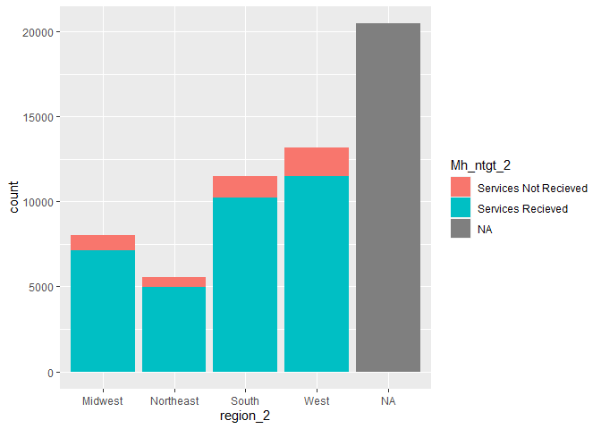

Midterm
================
Camille Parchment
2022-10-21

    ## ── Attaching packages ─────────────────────────────────────── tidyverse 1.3.2 ──
    ## ✔ ggplot2 3.3.6     ✔ purrr   0.3.4
    ## ✔ tibble  3.1.8     ✔ dplyr   1.0.9
    ## ✔ tidyr   1.2.0     ✔ stringr 1.4.1
    ## ✔ readr   2.1.2     ✔ forcats 0.5.2
    ## ── Conflicts ────────────────────────────────────────── tidyverse_conflicts() ──
    ## ✖ dplyr::between()   masks data.table::between()
    ## ✖ dplyr::filter()    masks stats::filter()
    ## ✖ dplyr::first()     masks data.table::first()
    ## ✖ dplyr::lag()       masks stats::lag()
    ## ✖ dplyr::last()      masks data.table::last()
    ## ✖ purrr::transpose() masks data.table::transpose()

    ## region_2
    ##   Midwest Northeast     South      West 
    ##      8025      5566     11505     13164

    ## [1] "South" NA      "South" "South" "South" "South"

<!-- --><!-- -->

<!-- -->

<!-- -->
<!-- -->
<!-- -->

    ## insurance
    ##                   both           No Insurance Private insurance only 
    ##                   7773                   2709                  22219 
    ##  Public insurance only                   <NA> 
    ##                   5559                  20469

<!-- -->

    ## 
    ## Attaching package: 'kableExtra'

    ## The following object is masked from 'package:dplyr':
    ## 
    ##     group_rows

    ## Warning: package 'kableExtra' is in use and will not be installed

    ## Warning in remove(public_insurance): object 'public_insurance' not found
