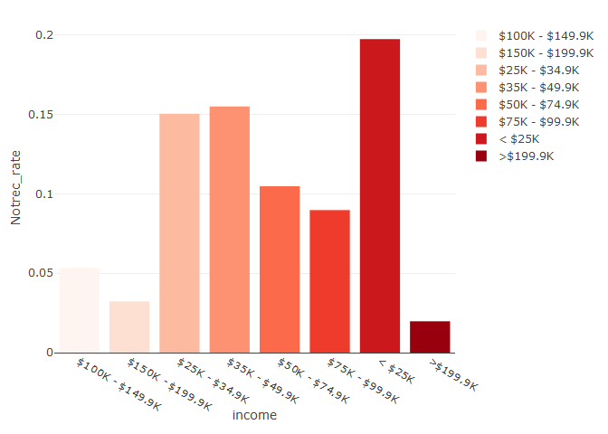

Midterm
================
Camille Parchment
2022-11-22

``` r
rm(list = ls())
```

    ## Warning: package 'data.table' was built under R version 4.2.2

    ## ── Attaching packages ─────────────────────────────────────── tidyverse 1.3.2 ──
    ## ✔ ggplot2 3.3.6     ✔ purrr   0.3.4
    ## ✔ tibble  3.1.8     ✔ dplyr   1.0.9
    ## ✔ tidyr   1.2.0     ✔ stringr 1.4.1
    ## ✔ readr   2.1.2     ✔ forcats 0.5.2
    ## ── Conflicts ────────────────────────────────────────── tidyverse_conflicts() ──
    ## ✖ dplyr::between()   masks data.table::between()
    ## ✖ dplyr::filter()    masks stats::filter()
    ## ✖ dplyr::first()     masks data.table::first()
    ## ✖ dplyr::lag()       masks stats::lag()
    ## ✖ dplyr::last()      masks data.table::last()
    ## ✖ purrr::transpose() masks data.table::transpose()

``` r
MHdf_2$income <- ifelse(MHdf_2$INCOME == "1", "< $25K",
                        ifelse(MHdf_2$INCOME == "2", "$25K - $34.9K",
                        ifelse(MHdf_2$INCOME == "3", "$35K - $49.9K",
                        ifelse(MHdf_2$INCOME == "4", "$50K - $74.9K",
                        ifelse(MHdf_2$INCOME == "5", "$75K - $99.9K", 
                        ifelse(MHdf_2$INCOME == "6", "$100K - $149.9K",
                        ifelse(MHdf_2$INCOME == "7", "$150K - $199.9K", ">$199.9K") 
                          
                        ))))))
```

``` r
MHdf_2$state <- ifelse(MHdf_2$EST_ST == "1","Alabama",
                ifelse(MHdf_2$EST_ST == "2", "Alaska",  
                ifelse(MHdf_2$EST_ST == "4", "Arizona", 
                ifelse(MHdf_2$EST_ST == "5", "Arkansas",
                ifelse(MHdf_2$EST_ST == "6", "California", 
                ifelse(MHdf_2$EST_ST == "8", "Colorado", 
                ifelse(MHdf_2$EST_ST == "9", "Connecticut", 
                ifelse(MHdf_2$EST_ST == "10","Delaware",
                ifelse(MHdf_2$EST_ST == "11", "District of Columbia", 
                ifelse(MHdf_2$EST_ST == "12", "Florida",     
                ifelse(MHdf_2$EST_ST == "13", "Georgia",
                ifelse(MHdf_2$EST_ST == "15", "Hawaii", 
                ifelse(MHdf_2$EST_ST == "16", "Idaho",
                ifelse(MHdf_2$EST_ST == "17", "Illinois", 
                ifelse(MHdf_2$EST_ST == "18", "Indiana",
                ifelse(MHdf_2$EST_ST == "19", "Iowa", 
                ifelse(MHdf_2$EST_ST == "20", "Kansas", 
                ifelse(MHdf_2$EST_ST == "21", "Kentucky", 
                ifelse(MHdf_2$EST_ST == "22", "Louisiana", 
                ifelse(MHdf_2$EST_ST == "23", "Maine", 
                ifelse(MHdf_2$EST_ST == "24", "Maryland", 
                ifelse(MHdf_2$EST_ST == "25", "Massachusetts", 
                ifelse(MHdf_2$EST_ST == "26", "Michigan", 
                ifelse(MHdf_2$EST_ST == "27", "Minnesota", 
                ifelse(MHdf_2$EST_ST == "28", "Mississippi", 
                ifelse(MHdf_2$EST_ST == "29", "Missouri", 
                ifelse(MHdf_2$EST_ST == "30", "Montana",
                ifelse(MHdf_2$EST_ST == "31", "Nebraska",
                ifelse(MHdf_2$EST_ST == "32", "Nevada", 
                ifelse(MHdf_2$EST_ST == "33", "New Hampshire",
                ifelse(MHdf_2$EST_ST == "34", "New Jersey",
                ifelse(MHdf_2$EST_ST == "35", "New Mexico",
                ifelse(MHdf_2$EST_ST == "36", "New York",
                ifelse(MHdf_2$EST_ST == "37", "North Carolina", 
                ifelse(MHdf_2$EST_ST == "38", "North Dakota", 
                ifelse(MHdf_2$EST_ST == "39", "Ohio",
                ifelse(MHdf_2$EST_ST == "40", "Oklahoma",
                ifelse(MHdf_2$EST_ST == "41", "Oregon",
                ifelse(MHdf_2$EST_ST == "42", "Pennsylvania",
                ifelse(MHdf_2$EST_ST == "44", "Rhode Island",
                ifelse(MHdf_2$EST_ST == "45", "South Carolina",
                ifelse(MHdf_2$EST_ST == "46", "South Dakota",
                ifelse(MHdf_2$EST_ST == "47", "Tennessee",
                ifelse(MHdf_2$EST_ST == "48", "Texas",
                ifelse(MHdf_2$EST_ST == "49", "Utah",
                ifelse(MHdf_2$EST_ST == "50", "Vermont",
                ifelse(MHdf_2$EST_ST == "51", "Virginia",
                ifelse(MHdf_2$EST_ST == "53", "Washington",
                ifelse(MHdf_2$EST_ST == "54", "West Virgina",
                ifelse(MHdf_2$EST_ST == "55", "Wisconsin", "Wyoming"
                      ))))))))))))))))))))))))))))))))))))))))))))))))))
                    table(MHdf_2$state, useNA = "always")
```

    ## 
    ##              Alabama               Alaska              Arizona 
    ##                  478                  959                 1080 
    ##             Arkansas           California             Colorado 
    ##                  502                 2748                 1182 
    ##          Connecticut             Delaware District of Columbia 
    ##                  595                  432                  508 
    ##              Florida              Georgia               Hawaii 
    ##                 1326                  789                  431 
    ##                Idaho             Illinois              Indiana 
    ##                  801                  989                  776 
    ##                 Iowa               Kansas             Kentucky 
    ##                  670                  712                  537 
    ##            Louisiana                Maine             Maryland 
    ##                  448                  337                  954 
    ##        Massachusetts             Michigan            Minnesota 
    ##                 1076                  837                  935 
    ##          Mississippi             Missouri              Montana 
    ##                  290                  631                  475 
    ##             Nebraska               Nevada        New Hampshire 
    ##                  607                  613                  571 
    ##           New Jersey           New Mexico             New York 
    ##                  667                  796                  803 
    ##       North Carolina         North Dakota                 Ohio 
    ##                  614                  388                  593 
    ##             Oklahoma               Oregon         Pennsylvania 
    ##                  549                 1094                  951 
    ##         Rhode Island       South Carolina         South Dakota 
    ##                  402                  525                  448 
    ##            Tennessee                Texas                 Utah 
    ##                  642                 1922                 1532 
    ##              Vermont             Virginia           Washington 
    ##                  422                 1017                 1592 
    ##         West Virgina            Wisconsin              Wyoming 
    ##                  385                  686                  461 
    ##                 <NA> 
    ##                    0

    ## 
    ##                   Both           No Insurance Private insurance only 
    ##                   9613                   2641                  21890 
    ##  Public insurance only                   <NA> 
    ##                   5634                      0

    ##                        
    ##                              Both No Insurance Private insurance only
    ##   Services Not Recieved  1.799990     1.390216               6.317562
    ##   Services Recieved     22.366635     5.249133              48.712856
    ##                        
    ##                         Public insurance only
    ##   Services Not Recieved              1.988536
    ##   Services Recieved                 12.175072

    ##                        
    ##                          Both No Insurance Private insurance only
    ##   Services Not Recieved   716          553                   2513
    ##   Services Recieved      8897         2088                  19377
    ##                        
    ##                         Public insurance only
    ##   Services Not Recieved                   791
    ##   Services Recieved                      4843

``` r
DF2 <- MHdf_2 %>%
dplyr::mutate(MH_NOTGET = ifelse(MHdf_2$MH_NOTGET == "1",1,0)) %>%
  filter(MHdf_2$insurance == "Public insurance only") %>%
  group_by(state) %>%
  summarise(Total_sv_needed = n(),
            num_notrec = sum(MH_NOTGET)) %>%
  mutate(services_rec = Total_sv_needed - num_notrec, 
  Notrec_rate = num_notrec/Total_sv_needed)  
```

``` r
DF4 <- MHdf_2 %>%
dplyr::mutate(MH_NOTGET = ifelse(MHdf_2$MH_NOTGET == "1",1,0)) %>%
  filter(MHdf_2$insurance == "Private insurance only") %>%
  group_by(state) %>%
  summarise(Total_sv_needed = n(),
            num_notrec = sum(MH_NOTGET)) %>%
  mutate(services_rec = Total_sv_needed - num_notrec, 
  Notrec_rate = num_notrec/Total_sv_needed) 
```

``` r
DF_income_Pub <- MHdf_2 %>%
dplyr::mutate(MH_NOTGET = ifelse(MHdf_2$MH_NOTGET == "1",1,0)) %>%
  filter(MHdf_2$insurance == "Public insurance only") %>%
  group_by(income) %>%
  summarise(Total_sv_needed = n(),
            num_notrec = sum(MH_NOTGET)) %>%
  mutate(services_rec = Total_sv_needed - num_notrec, 
  Notrec_rate = num_notrec/Total_sv_needed)  
```

``` r
DF_income_Pri <- MHdf_2 %>%
dplyr::mutate(MH_NOTGET = ifelse(MHdf_2$MH_NOTGET == "1",1,0)) %>%
  filter(MHdf_2$insurance == "Private insurance only") %>%
  group_by(income) %>%
  summarise(Total_sv_needed = n(),
            num_notrec = sum(MH_NOTGET)) %>%
  mutate(services_rec = Total_sv_needed - num_notrec, 
  Notrec_rate = num_notrec/Total_sv_needed)
```

``` r
DF_region_Pri <- MHdf_2 %>%
dplyr::mutate(MH_NOTGET = ifelse(MHdf_2$MH_NOTGET == "1",1,0)) %>%
  filter(MHdf_2$insurance == "Private insurance only") %>%
  group_by(region_2) %>%
  summarise(Total_sv_needed = n(),
            num_notrec = sum(MH_NOTGET)) %>%
  mutate(services_rec = Total_sv_needed - num_notrec, 
  Notrec_rate = num_notrec/Total_sv_needed)
```

``` r
DF_region_Pub <- MHdf_2 %>%
dplyr::mutate(MH_NOTGET = ifelse(MHdf_2$MH_NOTGET == "1",1,0)) %>%
  filter(MHdf_2$insurance == "Public insurance only") %>%
  group_by(region_2) %>%
  summarise(Total_sv_needed = n(),
            num_notrec = sum(MH_NOTGET)) %>%
  mutate(services_rec = Total_sv_needed - num_notrec, 
  Notrec_rate = num_notrec/Total_sv_needed)
```

DF3 \<- MHdf_2 %\>% dplyr::mutate(MH_NOTGET =
ifelse(MHdf_2$MH_NOTGET == "1",1,0)) %>%  filter(MHdf_2$insurance ==
“Private insurance only”) %\>% group_by(state) %\>% summarise(num_sv =
n(), num_rec = sum(MH_NOTGET)) %\>% mutate(services_nr = num_sv -
num_rec, rec_rate = num_rec/num_sv)

DF5 \<- MHdf_2 %\>% dplyr::mutate(MH_NOTGET =
ifelse(MHdf_2$MH_NOTGET == "1",1,0)) %>%  filter(MHdf_2$insurance ==
“Public insurance only”) %\>% group_by(state) %\>% summarise(num_sv =
n(), num_rec = sum(MH_NOTGET)) %\>% mutate(services_nr = num_sv -
num_rec, rec_rate = services_nr/num_sv)

<!-- -->

<!-- -->
<!-- -->

``` r
if(!require(plotly)) install.packages("plotly", repos = "http://cran.us.r-project.org")
```

    ## Loading required package: plotly

    ## Warning: package 'plotly' was built under R version 4.2.2

    ## 
    ## Attaching package: 'plotly'

    ## The following object is masked from 'package:ggplot2':
    ## 
    ##     last_plot

    ## The following object is masked from 'package:stats':
    ## 
    ##     filter

    ## The following object is masked from 'package:graphics':
    ## 
    ##     layout

``` r
library(plotly)
```

``` r
DF4 %>% 
           plot_ly(x = ~Total_sv_needed, y = ~num_notrec, 
                   type = 'scatter',
                   mode = 'markers',
                   color = ~state,
                   colors = "Blues")
```

    ## Warning in RColorBrewer::brewer.pal(n, pal): n too large, allowed maximum for palette Blues is 9
    ## Returning the palette you asked for with that many colors

    ## Warning in RColorBrewer::brewer.pal(n, pal): n too large, allowed maximum for palette Blues is 9
    ## Returning the palette you asked for with that many colors

    ## Warning in RColorBrewer::brewer.pal(n, pal): n too large, allowed maximum for palette Blues is 9
    ## Returning the palette you asked for with that many colors

    ## Warning in RColorBrewer::brewer.pal(n, pal): n too large, allowed maximum for palette Blues is 9
    ## Returning the palette you asked for with that many colors

    ## Warning in RColorBrewer::brewer.pal(n, pal): n too large, allowed maximum for palette Blues is 9
    ## Returning the palette you asked for with that many colors

    ## Warning in RColorBrewer::brewer.pal(n, pal): n too large, allowed maximum for palette Blues is 9
    ## Returning the palette you asked for with that many colors

    ## Warning in RColorBrewer::brewer.pal(n, pal): n too large, allowed maximum for palette Blues is 9
    ## Returning the palette you asked for with that many colors

    ## Warning in RColorBrewer::brewer.pal(n, pal): n too large, allowed maximum for palette Blues is 9
    ## Returning the palette you asked for with that many colors

    ## Warning in RColorBrewer::brewer.pal(n, pal): n too large, allowed maximum for palette Blues is 9
    ## Returning the palette you asked for with that many colors

    ## Warning in RColorBrewer::brewer.pal(n, pal): n too large, allowed maximum for palette Blues is 9
    ## Returning the palette you asked for with that many colors

    ## Warning in RColorBrewer::brewer.pal(n, pal): n too large, allowed maximum for palette Blues is 9
    ## Returning the palette you asked for with that many colors

    ## Warning in RColorBrewer::brewer.pal(n, pal): n too large, allowed maximum for palette Blues is 9
    ## Returning the palette you asked for with that many colors

    ## Warning in RColorBrewer::brewer.pal(n, pal): n too large, allowed maximum for palette Blues is 9
    ## Returning the palette you asked for with that many colors

    ## Warning in RColorBrewer::brewer.pal(n, pal): n too large, allowed maximum for palette Blues is 9
    ## Returning the palette you asked for with that many colors

    ## Warning in RColorBrewer::brewer.pal(n, pal): n too large, allowed maximum for palette Blues is 9
    ## Returning the palette you asked for with that many colors

    ## Warning in RColorBrewer::brewer.pal(n, pal): n too large, allowed maximum for palette Blues is 9
    ## Returning the palette you asked for with that many colors

    ## Warning in RColorBrewer::brewer.pal(n, pal): n too large, allowed maximum for palette Blues is 9
    ## Returning the palette you asked for with that many colors

    ## Warning in RColorBrewer::brewer.pal(n, pal): n too large, allowed maximum for palette Blues is 9
    ## Returning the palette you asked for with that many colors

    ## Warning in RColorBrewer::brewer.pal(n, pal): n too large, allowed maximum for palette Blues is 9
    ## Returning the palette you asked for with that many colors

    ## Warning in RColorBrewer::brewer.pal(n, pal): n too large, allowed maximum for palette Blues is 9
    ## Returning the palette you asked for with that many colors

    ## Warning in RColorBrewer::brewer.pal(n, pal): n too large, allowed maximum for palette Blues is 9
    ## Returning the palette you asked for with that many colors

    ## Warning in RColorBrewer::brewer.pal(n, pal): n too large, allowed maximum for palette Blues is 9
    ## Returning the palette you asked for with that many colors

    ## Warning in RColorBrewer::brewer.pal(n, pal): n too large, allowed maximum for palette Blues is 9
    ## Returning the palette you asked for with that many colors

    ## Warning in RColorBrewer::brewer.pal(n, pal): n too large, allowed maximum for palette Blues is 9
    ## Returning the palette you asked for with that many colors

    ## Warning in RColorBrewer::brewer.pal(n, pal): n too large, allowed maximum for palette Blues is 9
    ## Returning the palette you asked for with that many colors

    ## Warning in RColorBrewer::brewer.pal(n, pal): n too large, allowed maximum for palette Blues is 9
    ## Returning the palette you asked for with that many colors

    ## Warning in RColorBrewer::brewer.pal(n, pal): n too large, allowed maximum for palette Blues is 9
    ## Returning the palette you asked for with that many colors

    ## Warning in RColorBrewer::brewer.pal(n, pal): n too large, allowed maximum for palette Blues is 9
    ## Returning the palette you asked for with that many colors

    ## Warning in RColorBrewer::brewer.pal(n, pal): n too large, allowed maximum for palette Blues is 9
    ## Returning the palette you asked for with that many colors

    ## Warning in RColorBrewer::brewer.pal(n, pal): n too large, allowed maximum for palette Blues is 9
    ## Returning the palette you asked for with that many colors

    ## Warning in RColorBrewer::brewer.pal(n, pal): n too large, allowed maximum for palette Blues is 9
    ## Returning the palette you asked for with that many colors

    ## Warning in RColorBrewer::brewer.pal(n, pal): n too large, allowed maximum for palette Blues is 9
    ## Returning the palette you asked for with that many colors

    ## Warning in RColorBrewer::brewer.pal(n, pal): n too large, allowed maximum for palette Blues is 9
    ## Returning the palette you asked for with that many colors

    ## Warning in RColorBrewer::brewer.pal(n, pal): n too large, allowed maximum for palette Blues is 9
    ## Returning the palette you asked for with that many colors

    ## Warning in RColorBrewer::brewer.pal(n, pal): n too large, allowed maximum for palette Blues is 9
    ## Returning the palette you asked for with that many colors

    ## Warning in RColorBrewer::brewer.pal(n, pal): n too large, allowed maximum for palette Blues is 9
    ## Returning the palette you asked for with that many colors

    ## Warning in RColorBrewer::brewer.pal(n, pal): n too large, allowed maximum for palette Blues is 9
    ## Returning the palette you asked for with that many colors

    ## Warning in RColorBrewer::brewer.pal(n, pal): n too large, allowed maximum for palette Blues is 9
    ## Returning the palette you asked for with that many colors

    ## Warning in RColorBrewer::brewer.pal(n, pal): n too large, allowed maximum for palette Blues is 9
    ## Returning the palette you asked for with that many colors

    ## Warning in RColorBrewer::brewer.pal(n, pal): n too large, allowed maximum for palette Blues is 9
    ## Returning the palette you asked for with that many colors

    ## Warning in RColorBrewer::brewer.pal(n, pal): n too large, allowed maximum for palette Blues is 9
    ## Returning the palette you asked for with that many colors

    ## Warning in RColorBrewer::brewer.pal(n, pal): n too large, allowed maximum for palette Blues is 9
    ## Returning the palette you asked for with that many colors

    ## Warning in RColorBrewer::brewer.pal(n, pal): n too large, allowed maximum for palette Blues is 9
    ## Returning the palette you asked for with that many colors

    ## Warning in RColorBrewer::brewer.pal(n, pal): n too large, allowed maximum for palette Blues is 9
    ## Returning the palette you asked for with that many colors

    ## Warning in RColorBrewer::brewer.pal(n, pal): n too large, allowed maximum for palette Blues is 9
    ## Returning the palette you asked for with that many colors

    ## Warning in RColorBrewer::brewer.pal(n, pal): n too large, allowed maximum for palette Blues is 9
    ## Returning the palette you asked for with that many colors

    ## Warning in RColorBrewer::brewer.pal(n, pal): n too large, allowed maximum for palette Blues is 9
    ## Returning the palette you asked for with that many colors

    ## Warning in RColorBrewer::brewer.pal(n, pal): n too large, allowed maximum for palette Blues is 9
    ## Returning the palette you asked for with that many colors

    ## Warning in RColorBrewer::brewer.pal(n, pal): n too large, allowed maximum for palette Blues is 9
    ## Returning the palette you asked for with that many colors

    ## Warning in RColorBrewer::brewer.pal(n, pal): n too large, allowed maximum for palette Blues is 9
    ## Returning the palette you asked for with that many colors

    ## Warning in RColorBrewer::brewer.pal(n, pal): n too large, allowed maximum for palette Blues is 9
    ## Returning the palette you asked for with that many colors

    ## Warning in RColorBrewer::brewer.pal(n, pal): n too large, allowed maximum for palette Blues is 9
    ## Returning the palette you asked for with that many colors

    ## Warning in RColorBrewer::brewer.pal(n, pal): n too large, allowed maximum for palette Blues is 9
    ## Returning the palette you asked for with that many colors

    ## Warning in RColorBrewer::brewer.pal(n, pal): n too large, allowed maximum for palette Blues is 9
    ## Returning the palette you asked for with that many colors

    ## Warning in RColorBrewer::brewer.pal(n, pal): n too large, allowed maximum for palette Blues is 9
    ## Returning the palette you asked for with that many colors

    ## Warning in RColorBrewer::brewer.pal(n, pal): n too large, allowed maximum for palette Blues is 9
    ## Returning the palette you asked for with that many colors

    ## Warning in RColorBrewer::brewer.pal(n, pal): n too large, allowed maximum for palette Blues is 9
    ## Returning the palette you asked for with that many colors

    ## Warning in RColorBrewer::brewer.pal(n, pal): n too large, allowed maximum for palette Blues is 9
    ## Returning the palette you asked for with that many colors

    ## Warning in RColorBrewer::brewer.pal(n, pal): n too large, allowed maximum for palette Blues is 9
    ## Returning the palette you asked for with that many colors

    ## Warning in RColorBrewer::brewer.pal(n, pal): n too large, allowed maximum for palette Blues is 9
    ## Returning the palette you asked for with that many colors

    ## Warning in RColorBrewer::brewer.pal(n, pal): n too large, allowed maximum for palette Blues is 9
    ## Returning the palette you asked for with that many colors

    ## Warning in RColorBrewer::brewer.pal(n, pal): n too large, allowed maximum for palette Blues is 9
    ## Returning the palette you asked for with that many colors

    ## Warning in RColorBrewer::brewer.pal(n, pal): n too large, allowed maximum for palette Blues is 9
    ## Returning the palette you asked for with that many colors

    ## Warning in RColorBrewer::brewer.pal(n, pal): n too large, allowed maximum for palette Blues is 9
    ## Returning the palette you asked for with that many colors

    ## Warning in RColorBrewer::brewer.pal(n, pal): n too large, allowed maximum for palette Blues is 9
    ## Returning the palette you asked for with that many colors

    ## Warning in RColorBrewer::brewer.pal(n, pal): n too large, allowed maximum for palette Blues is 9
    ## Returning the palette you asked for with that many colors

    ## Warning in RColorBrewer::brewer.pal(n, pal): n too large, allowed maximum for palette Blues is 9
    ## Returning the palette you asked for with that many colors

    ## Warning in RColorBrewer::brewer.pal(n, pal): n too large, allowed maximum for palette Blues is 9
    ## Returning the palette you asked for with that many colors

    ## Warning in RColorBrewer::brewer.pal(n, pal): n too large, allowed maximum for palette Blues is 9
    ## Returning the palette you asked for with that many colors

    ## Warning in RColorBrewer::brewer.pal(n, pal): n too large, allowed maximum for palette Blues is 9
    ## Returning the palette you asked for with that many colors

    ## Warning in RColorBrewer::brewer.pal(n, pal): n too large, allowed maximum for palette Blues is 9
    ## Returning the palette you asked for with that many colors

    ## Warning in RColorBrewer::brewer.pal(n, pal): n too large, allowed maximum for palette Blues is 9
    ## Returning the palette you asked for with that many colors

    ## Warning in RColorBrewer::brewer.pal(n, pal): n too large, allowed maximum for palette Blues is 9
    ## Returning the palette you asked for with that many colors

    ## Warning in RColorBrewer::brewer.pal(n, pal): n too large, allowed maximum for palette Blues is 9
    ## Returning the palette you asked for with that many colors

    ## Warning in RColorBrewer::brewer.pal(n, pal): n too large, allowed maximum for palette Blues is 9
    ## Returning the palette you asked for with that many colors

    ## Warning in RColorBrewer::brewer.pal(n, pal): n too large, allowed maximum for palette Blues is 9
    ## Returning the palette you asked for with that many colors

    ## Warning in RColorBrewer::brewer.pal(n, pal): n too large, allowed maximum for palette Blues is 9
    ## Returning the palette you asked for with that many colors

    ## Warning in RColorBrewer::brewer.pal(n, pal): n too large, allowed maximum for palette Blues is 9
    ## Returning the palette you asked for with that many colors

    ## Warning in RColorBrewer::brewer.pal(n, pal): n too large, allowed maximum for palette Blues is 9
    ## Returning the palette you asked for with that many colors

    ## Warning in RColorBrewer::brewer.pal(n, pal): n too large, allowed maximum for palette Blues is 9
    ## Returning the palette you asked for with that many colors

    ## Warning in RColorBrewer::brewer.pal(n, pal): n too large, allowed maximum for palette Blues is 9
    ## Returning the palette you asked for with that many colors

    ## Warning in RColorBrewer::brewer.pal(n, pal): n too large, allowed maximum for palette Blues is 9
    ## Returning the palette you asked for with that many colors

    ## Warning in RColorBrewer::brewer.pal(n, pal): n too large, allowed maximum for palette Blues is 9
    ## Returning the palette you asked for with that many colors

    ## Warning in RColorBrewer::brewer.pal(n, pal): n too large, allowed maximum for palette Blues is 9
    ## Returning the palette you asked for with that many colors

    ## Warning in RColorBrewer::brewer.pal(n, pal): n too large, allowed maximum for palette Blues is 9
    ## Returning the palette you asked for with that many colors

    ## Warning in RColorBrewer::brewer.pal(n, pal): n too large, allowed maximum for palette Blues is 9
    ## Returning the palette you asked for with that many colors

    ## Warning in RColorBrewer::brewer.pal(n, pal): n too large, allowed maximum for palette Blues is 9
    ## Returning the palette you asked for with that many colors

    ## Warning in RColorBrewer::brewer.pal(n, pal): n too large, allowed maximum for palette Blues is 9
    ## Returning the palette you asked for with that many colors

    ## Warning in RColorBrewer::brewer.pal(n, pal): n too large, allowed maximum for palette Blues is 9
    ## Returning the palette you asked for with that many colors

    ## Warning in RColorBrewer::brewer.pal(n, pal): n too large, allowed maximum for palette Blues is 9
    ## Returning the palette you asked for with that many colors

    ## Warning in RColorBrewer::brewer.pal(n, pal): n too large, allowed maximum for palette Blues is 9
    ## Returning the palette you asked for with that many colors

    ## Warning in RColorBrewer::brewer.pal(n, pal): n too large, allowed maximum for palette Blues is 9
    ## Returning the palette you asked for with that many colors

    ## Warning in RColorBrewer::brewer.pal(n, pal): n too large, allowed maximum for palette Blues is 9
    ## Returning the palette you asked for with that many colors

    ## Warning in RColorBrewer::brewer.pal(n, pal): n too large, allowed maximum for palette Blues is 9
    ## Returning the palette you asked for with that many colors

    ## Warning in RColorBrewer::brewer.pal(n, pal): n too large, allowed maximum for palette Blues is 9
    ## Returning the palette you asked for with that many colors

    ## Warning in RColorBrewer::brewer.pal(n, pal): n too large, allowed maximum for palette Blues is 9
    ## Returning the palette you asked for with that many colors

    ## Warning in RColorBrewer::brewer.pal(n, pal): n too large, allowed maximum for palette Blues is 9
    ## Returning the palette you asked for with that many colors

    ## Warning in RColorBrewer::brewer.pal(n, pal): n too large, allowed maximum for palette Blues is 9
    ## Returning the palette you asked for with that many colors

    ## Warning in RColorBrewer::brewer.pal(n, pal): n too large, allowed maximum for palette Blues is 9
    ## Returning the palette you asked for with that many colors

    ## Warning in RColorBrewer::brewer.pal(n, pal): n too large, allowed maximum for palette Blues is 9
    ## Returning the palette you asked for with that many colors

    ## Warning in RColorBrewer::brewer.pal(n, pal): n too large, allowed maximum for palette Blues is 9
    ## Returning the palette you asked for with that many colors

    ## Warning in RColorBrewer::brewer.pal(n, pal): n too large, allowed maximum for palette Blues is 9
    ## Returning the palette you asked for with that many colors

<!-- -->

``` r
DF2 %>% 
           plot_ly(x = ~Total_sv_needed, y = ~num_notrec, 
                   type = 'scatter',
                   mode = 'markers',
                   color = ~state,
                   colors = "Purples")
```

    ## Warning in RColorBrewer::brewer.pal(n, pal): n too large, allowed maximum for palette Purples is 9
    ## Returning the palette you asked for with that many colors

    ## Warning in RColorBrewer::brewer.pal(n, pal): n too large, allowed maximum for palette Purples is 9
    ## Returning the palette you asked for with that many colors

    ## Warning in RColorBrewer::brewer.pal(n, pal): n too large, allowed maximum for palette Purples is 9
    ## Returning the palette you asked for with that many colors

    ## Warning in RColorBrewer::brewer.pal(n, pal): n too large, allowed maximum for palette Purples is 9
    ## Returning the palette you asked for with that many colors

    ## Warning in RColorBrewer::brewer.pal(n, pal): n too large, allowed maximum for palette Purples is 9
    ## Returning the palette you asked for with that many colors

    ## Warning in RColorBrewer::brewer.pal(n, pal): n too large, allowed maximum for palette Purples is 9
    ## Returning the palette you asked for with that many colors

    ## Warning in RColorBrewer::brewer.pal(n, pal): n too large, allowed maximum for palette Purples is 9
    ## Returning the palette you asked for with that many colors

    ## Warning in RColorBrewer::brewer.pal(n, pal): n too large, allowed maximum for palette Purples is 9
    ## Returning the palette you asked for with that many colors

    ## Warning in RColorBrewer::brewer.pal(n, pal): n too large, allowed maximum for palette Purples is 9
    ## Returning the palette you asked for with that many colors

    ## Warning in RColorBrewer::brewer.pal(n, pal): n too large, allowed maximum for palette Purples is 9
    ## Returning the palette you asked for with that many colors

    ## Warning in RColorBrewer::brewer.pal(n, pal): n too large, allowed maximum for palette Purples is 9
    ## Returning the palette you asked for with that many colors

    ## Warning in RColorBrewer::brewer.pal(n, pal): n too large, allowed maximum for palette Purples is 9
    ## Returning the palette you asked for with that many colors

    ## Warning in RColorBrewer::brewer.pal(n, pal): n too large, allowed maximum for palette Purples is 9
    ## Returning the palette you asked for with that many colors

    ## Warning in RColorBrewer::brewer.pal(n, pal): n too large, allowed maximum for palette Purples is 9
    ## Returning the palette you asked for with that many colors

    ## Warning in RColorBrewer::brewer.pal(n, pal): n too large, allowed maximum for palette Purples is 9
    ## Returning the palette you asked for with that many colors

    ## Warning in RColorBrewer::brewer.pal(n, pal): n too large, allowed maximum for palette Purples is 9
    ## Returning the palette you asked for with that many colors

    ## Warning in RColorBrewer::brewer.pal(n, pal): n too large, allowed maximum for palette Purples is 9
    ## Returning the palette you asked for with that many colors

    ## Warning in RColorBrewer::brewer.pal(n, pal): n too large, allowed maximum for palette Purples is 9
    ## Returning the palette you asked for with that many colors

    ## Warning in RColorBrewer::brewer.pal(n, pal): n too large, allowed maximum for palette Purples is 9
    ## Returning the palette you asked for with that many colors

    ## Warning in RColorBrewer::brewer.pal(n, pal): n too large, allowed maximum for palette Purples is 9
    ## Returning the palette you asked for with that many colors

    ## Warning in RColorBrewer::brewer.pal(n, pal): n too large, allowed maximum for palette Purples is 9
    ## Returning the palette you asked for with that many colors

    ## Warning in RColorBrewer::brewer.pal(n, pal): n too large, allowed maximum for palette Purples is 9
    ## Returning the palette you asked for with that many colors

    ## Warning in RColorBrewer::brewer.pal(n, pal): n too large, allowed maximum for palette Purples is 9
    ## Returning the palette you asked for with that many colors

    ## Warning in RColorBrewer::brewer.pal(n, pal): n too large, allowed maximum for palette Purples is 9
    ## Returning the palette you asked for with that many colors

    ## Warning in RColorBrewer::brewer.pal(n, pal): n too large, allowed maximum for palette Purples is 9
    ## Returning the palette you asked for with that many colors

    ## Warning in RColorBrewer::brewer.pal(n, pal): n too large, allowed maximum for palette Purples is 9
    ## Returning the palette you asked for with that many colors

    ## Warning in RColorBrewer::brewer.pal(n, pal): n too large, allowed maximum for palette Purples is 9
    ## Returning the palette you asked for with that many colors

    ## Warning in RColorBrewer::brewer.pal(n, pal): n too large, allowed maximum for palette Purples is 9
    ## Returning the palette you asked for with that many colors

    ## Warning in RColorBrewer::brewer.pal(n, pal): n too large, allowed maximum for palette Purples is 9
    ## Returning the palette you asked for with that many colors

    ## Warning in RColorBrewer::brewer.pal(n, pal): n too large, allowed maximum for palette Purples is 9
    ## Returning the palette you asked for with that many colors

    ## Warning in RColorBrewer::brewer.pal(n, pal): n too large, allowed maximum for palette Purples is 9
    ## Returning the palette you asked for with that many colors

    ## Warning in RColorBrewer::brewer.pal(n, pal): n too large, allowed maximum for palette Purples is 9
    ## Returning the palette you asked for with that many colors

    ## Warning in RColorBrewer::brewer.pal(n, pal): n too large, allowed maximum for palette Purples is 9
    ## Returning the palette you asked for with that many colors

    ## Warning in RColorBrewer::brewer.pal(n, pal): n too large, allowed maximum for palette Purples is 9
    ## Returning the palette you asked for with that many colors

    ## Warning in RColorBrewer::brewer.pal(n, pal): n too large, allowed maximum for palette Purples is 9
    ## Returning the palette you asked for with that many colors

    ## Warning in RColorBrewer::brewer.pal(n, pal): n too large, allowed maximum for palette Purples is 9
    ## Returning the palette you asked for with that many colors

    ## Warning in RColorBrewer::brewer.pal(n, pal): n too large, allowed maximum for palette Purples is 9
    ## Returning the palette you asked for with that many colors

    ## Warning in RColorBrewer::brewer.pal(n, pal): n too large, allowed maximum for palette Purples is 9
    ## Returning the palette you asked for with that many colors

    ## Warning in RColorBrewer::brewer.pal(n, pal): n too large, allowed maximum for palette Purples is 9
    ## Returning the palette you asked for with that many colors

    ## Warning in RColorBrewer::brewer.pal(n, pal): n too large, allowed maximum for palette Purples is 9
    ## Returning the palette you asked for with that many colors

    ## Warning in RColorBrewer::brewer.pal(n, pal): n too large, allowed maximum for palette Purples is 9
    ## Returning the palette you asked for with that many colors

    ## Warning in RColorBrewer::brewer.pal(n, pal): n too large, allowed maximum for palette Purples is 9
    ## Returning the palette you asked for with that many colors

    ## Warning in RColorBrewer::brewer.pal(n, pal): n too large, allowed maximum for palette Purples is 9
    ## Returning the palette you asked for with that many colors

    ## Warning in RColorBrewer::brewer.pal(n, pal): n too large, allowed maximum for palette Purples is 9
    ## Returning the palette you asked for with that many colors

    ## Warning in RColorBrewer::brewer.pal(n, pal): n too large, allowed maximum for palette Purples is 9
    ## Returning the palette you asked for with that many colors

    ## Warning in RColorBrewer::brewer.pal(n, pal): n too large, allowed maximum for palette Purples is 9
    ## Returning the palette you asked for with that many colors

    ## Warning in RColorBrewer::brewer.pal(n, pal): n too large, allowed maximum for palette Purples is 9
    ## Returning the palette you asked for with that many colors

    ## Warning in RColorBrewer::brewer.pal(n, pal): n too large, allowed maximum for palette Purples is 9
    ## Returning the palette you asked for with that many colors

    ## Warning in RColorBrewer::brewer.pal(n, pal): n too large, allowed maximum for palette Purples is 9
    ## Returning the palette you asked for with that many colors

    ## Warning in RColorBrewer::brewer.pal(n, pal): n too large, allowed maximum for palette Purples is 9
    ## Returning the palette you asked for with that many colors

    ## Warning in RColorBrewer::brewer.pal(n, pal): n too large, allowed maximum for palette Purples is 9
    ## Returning the palette you asked for with that many colors

    ## Warning in RColorBrewer::brewer.pal(n, pal): n too large, allowed maximum for palette Purples is 9
    ## Returning the palette you asked for with that many colors

    ## Warning in RColorBrewer::brewer.pal(n, pal): n too large, allowed maximum for palette Purples is 9
    ## Returning the palette you asked for with that many colors

    ## Warning in RColorBrewer::brewer.pal(n, pal): n too large, allowed maximum for palette Purples is 9
    ## Returning the palette you asked for with that many colors

    ## Warning in RColorBrewer::brewer.pal(n, pal): n too large, allowed maximum for palette Purples is 9
    ## Returning the palette you asked for with that many colors

    ## Warning in RColorBrewer::brewer.pal(n, pal): n too large, allowed maximum for palette Purples is 9
    ## Returning the palette you asked for with that many colors

    ## Warning in RColorBrewer::brewer.pal(n, pal): n too large, allowed maximum for palette Purples is 9
    ## Returning the palette you asked for with that many colors

    ## Warning in RColorBrewer::brewer.pal(n, pal): n too large, allowed maximum for palette Purples is 9
    ## Returning the palette you asked for with that many colors

    ## Warning in RColorBrewer::brewer.pal(n, pal): n too large, allowed maximum for palette Purples is 9
    ## Returning the palette you asked for with that many colors

    ## Warning in RColorBrewer::brewer.pal(n, pal): n too large, allowed maximum for palette Purples is 9
    ## Returning the palette you asked for with that many colors

    ## Warning in RColorBrewer::brewer.pal(n, pal): n too large, allowed maximum for palette Purples is 9
    ## Returning the palette you asked for with that many colors

    ## Warning in RColorBrewer::brewer.pal(n, pal): n too large, allowed maximum for palette Purples is 9
    ## Returning the palette you asked for with that many colors

    ## Warning in RColorBrewer::brewer.pal(n, pal): n too large, allowed maximum for palette Purples is 9
    ## Returning the palette you asked for with that many colors

    ## Warning in RColorBrewer::brewer.pal(n, pal): n too large, allowed maximum for palette Purples is 9
    ## Returning the palette you asked for with that many colors

    ## Warning in RColorBrewer::brewer.pal(n, pal): n too large, allowed maximum for palette Purples is 9
    ## Returning the palette you asked for with that many colors

    ## Warning in RColorBrewer::brewer.pal(n, pal): n too large, allowed maximum for palette Purples is 9
    ## Returning the palette you asked for with that many colors

    ## Warning in RColorBrewer::brewer.pal(n, pal): n too large, allowed maximum for palette Purples is 9
    ## Returning the palette you asked for with that many colors

    ## Warning in RColorBrewer::brewer.pal(n, pal): n too large, allowed maximum for palette Purples is 9
    ## Returning the palette you asked for with that many colors

    ## Warning in RColorBrewer::brewer.pal(n, pal): n too large, allowed maximum for palette Purples is 9
    ## Returning the palette you asked for with that many colors

    ## Warning in RColorBrewer::brewer.pal(n, pal): n too large, allowed maximum for palette Purples is 9
    ## Returning the palette you asked for with that many colors

    ## Warning in RColorBrewer::brewer.pal(n, pal): n too large, allowed maximum for palette Purples is 9
    ## Returning the palette you asked for with that many colors

    ## Warning in RColorBrewer::brewer.pal(n, pal): n too large, allowed maximum for palette Purples is 9
    ## Returning the palette you asked for with that many colors

    ## Warning in RColorBrewer::brewer.pal(n, pal): n too large, allowed maximum for palette Purples is 9
    ## Returning the palette you asked for with that many colors

    ## Warning in RColorBrewer::brewer.pal(n, pal): n too large, allowed maximum for palette Purples is 9
    ## Returning the palette you asked for with that many colors

    ## Warning in RColorBrewer::brewer.pal(n, pal): n too large, allowed maximum for palette Purples is 9
    ## Returning the palette you asked for with that many colors

    ## Warning in RColorBrewer::brewer.pal(n, pal): n too large, allowed maximum for palette Purples is 9
    ## Returning the palette you asked for with that many colors

    ## Warning in RColorBrewer::brewer.pal(n, pal): n too large, allowed maximum for palette Purples is 9
    ## Returning the palette you asked for with that many colors

    ## Warning in RColorBrewer::brewer.pal(n, pal): n too large, allowed maximum for palette Purples is 9
    ## Returning the palette you asked for with that many colors

    ## Warning in RColorBrewer::brewer.pal(n, pal): n too large, allowed maximum for palette Purples is 9
    ## Returning the palette you asked for with that many colors

    ## Warning in RColorBrewer::brewer.pal(n, pal): n too large, allowed maximum for palette Purples is 9
    ## Returning the palette you asked for with that many colors

    ## Warning in RColorBrewer::brewer.pal(n, pal): n too large, allowed maximum for palette Purples is 9
    ## Returning the palette you asked for with that many colors

    ## Warning in RColorBrewer::brewer.pal(n, pal): n too large, allowed maximum for palette Purples is 9
    ## Returning the palette you asked for with that many colors

    ## Warning in RColorBrewer::brewer.pal(n, pal): n too large, allowed maximum for palette Purples is 9
    ## Returning the palette you asked for with that many colors

    ## Warning in RColorBrewer::brewer.pal(n, pal): n too large, allowed maximum for palette Purples is 9
    ## Returning the palette you asked for with that many colors

    ## Warning in RColorBrewer::brewer.pal(n, pal): n too large, allowed maximum for palette Purples is 9
    ## Returning the palette you asked for with that many colors

    ## Warning in RColorBrewer::brewer.pal(n, pal): n too large, allowed maximum for palette Purples is 9
    ## Returning the palette you asked for with that many colors

    ## Warning in RColorBrewer::brewer.pal(n, pal): n too large, allowed maximum for palette Purples is 9
    ## Returning the palette you asked for with that many colors

    ## Warning in RColorBrewer::brewer.pal(n, pal): n too large, allowed maximum for palette Purples is 9
    ## Returning the palette you asked for with that many colors

    ## Warning in RColorBrewer::brewer.pal(n, pal): n too large, allowed maximum for palette Purples is 9
    ## Returning the palette you asked for with that many colors

    ## Warning in RColorBrewer::brewer.pal(n, pal): n too large, allowed maximum for palette Purples is 9
    ## Returning the palette you asked for with that many colors

    ## Warning in RColorBrewer::brewer.pal(n, pal): n too large, allowed maximum for palette Purples is 9
    ## Returning the palette you asked for with that many colors

    ## Warning in RColorBrewer::brewer.pal(n, pal): n too large, allowed maximum for palette Purples is 9
    ## Returning the palette you asked for with that many colors

    ## Warning in RColorBrewer::brewer.pal(n, pal): n too large, allowed maximum for palette Purples is 9
    ## Returning the palette you asked for with that many colors

    ## Warning in RColorBrewer::brewer.pal(n, pal): n too large, allowed maximum for palette Purples is 9
    ## Returning the palette you asked for with that many colors

    ## Warning in RColorBrewer::brewer.pal(n, pal): n too large, allowed maximum for palette Purples is 9
    ## Returning the palette you asked for with that many colors

    ## Warning in RColorBrewer::brewer.pal(n, pal): n too large, allowed maximum for palette Purples is 9
    ## Returning the palette you asked for with that many colors

    ## Warning in RColorBrewer::brewer.pal(n, pal): n too large, allowed maximum for palette Purples is 9
    ## Returning the palette you asked for with that many colors

    ## Warning in RColorBrewer::brewer.pal(n, pal): n too large, allowed maximum for palette Purples is 9
    ## Returning the palette you asked for with that many colors

    ## Warning in RColorBrewer::brewer.pal(n, pal): n too large, allowed maximum for palette Purples is 9
    ## Returning the palette you asked for with that many colors

    ## Warning in RColorBrewer::brewer.pal(n, pal): n too large, allowed maximum for palette Purples is 9
    ## Returning the palette you asked for with that many colors

    ## Warning in RColorBrewer::brewer.pal(n, pal): n too large, allowed maximum for palette Purples is 9
    ## Returning the palette you asked for with that many colors

    ## Warning in RColorBrewer::brewer.pal(n, pal): n too large, allowed maximum for palette Purples is 9
    ## Returning the palette you asked for with that many colors

<!-- -->

``` r
DF_region_Pri %>%
  
plot_ly(x = ~region_2, y = ~num_notrec, 
                   type = 'bar',
                   mode = 'markers',
                   color = ~region_2,
                   colors = "Blues")
```

    ## Warning: 'bar' objects don't have these attributes: 'mode'
    ## Valid attributes include:
    ## '_deprecated', 'alignmentgroup', 'base', 'basesrc', 'cliponaxis', 'constraintext', 'customdata', 'customdatasrc', 'dx', 'dy', 'error_x', 'error_y', 'hoverinfo', 'hoverinfosrc', 'hoverlabel', 'hovertemplate', 'hovertemplatesrc', 'hovertext', 'hovertextsrc', 'ids', 'idssrc', 'insidetextanchor', 'insidetextfont', 'legendgroup', 'legendgrouptitle', 'legendrank', 'marker', 'meta', 'metasrc', 'name', 'offset', 'offsetgroup', 'offsetsrc', 'opacity', 'orientation', 'outsidetextfont', 'selected', 'selectedpoints', 'showlegend', 'stream', 'text', 'textangle', 'textfont', 'textposition', 'textpositionsrc', 'textsrc', 'texttemplate', 'texttemplatesrc', 'transforms', 'type', 'uid', 'uirevision', 'unselected', 'visible', 'width', 'widthsrc', 'x', 'x0', 'xaxis', 'xcalendar', 'xhoverformat', 'xperiod', 'xperiod0', 'xperiodalignment', 'xsrc', 'y', 'y0', 'yaxis', 'ycalendar', 'yhoverformat', 'yperiod', 'yperiod0', 'yperiodalignment', 'ysrc', 'key', 'set', 'frame', 'transforms', '_isNestedKey', '_isSimpleKey', '_isGraticule', '_bbox'

    ## Warning: 'bar' objects don't have these attributes: 'mode'
    ## Valid attributes include:
    ## '_deprecated', 'alignmentgroup', 'base', 'basesrc', 'cliponaxis', 'constraintext', 'customdata', 'customdatasrc', 'dx', 'dy', 'error_x', 'error_y', 'hoverinfo', 'hoverinfosrc', 'hoverlabel', 'hovertemplate', 'hovertemplatesrc', 'hovertext', 'hovertextsrc', 'ids', 'idssrc', 'insidetextanchor', 'insidetextfont', 'legendgroup', 'legendgrouptitle', 'legendrank', 'marker', 'meta', 'metasrc', 'name', 'offset', 'offsetgroup', 'offsetsrc', 'opacity', 'orientation', 'outsidetextfont', 'selected', 'selectedpoints', 'showlegend', 'stream', 'text', 'textangle', 'textfont', 'textposition', 'textpositionsrc', 'textsrc', 'texttemplate', 'texttemplatesrc', 'transforms', 'type', 'uid', 'uirevision', 'unselected', 'visible', 'width', 'widthsrc', 'x', 'x0', 'xaxis', 'xcalendar', 'xhoverformat', 'xperiod', 'xperiod0', 'xperiodalignment', 'xsrc', 'y', 'y0', 'yaxis', 'ycalendar', 'yhoverformat', 'yperiod', 'yperiod0', 'yperiodalignment', 'ysrc', 'key', 'set', 'frame', 'transforms', '_isNestedKey', '_isSimpleKey', '_isGraticule', '_bbox'

    ## Warning: 'bar' objects don't have these attributes: 'mode'
    ## Valid attributes include:
    ## '_deprecated', 'alignmentgroup', 'base', 'basesrc', 'cliponaxis', 'constraintext', 'customdata', 'customdatasrc', 'dx', 'dy', 'error_x', 'error_y', 'hoverinfo', 'hoverinfosrc', 'hoverlabel', 'hovertemplate', 'hovertemplatesrc', 'hovertext', 'hovertextsrc', 'ids', 'idssrc', 'insidetextanchor', 'insidetextfont', 'legendgroup', 'legendgrouptitle', 'legendrank', 'marker', 'meta', 'metasrc', 'name', 'offset', 'offsetgroup', 'offsetsrc', 'opacity', 'orientation', 'outsidetextfont', 'selected', 'selectedpoints', 'showlegend', 'stream', 'text', 'textangle', 'textfont', 'textposition', 'textpositionsrc', 'textsrc', 'texttemplate', 'texttemplatesrc', 'transforms', 'type', 'uid', 'uirevision', 'unselected', 'visible', 'width', 'widthsrc', 'x', 'x0', 'xaxis', 'xcalendar', 'xhoverformat', 'xperiod', 'xperiod0', 'xperiodalignment', 'xsrc', 'y', 'y0', 'yaxis', 'ycalendar', 'yhoverformat', 'yperiod', 'yperiod0', 'yperiodalignment', 'ysrc', 'key', 'set', 'frame', 'transforms', '_isNestedKey', '_isSimpleKey', '_isGraticule', '_bbox'

    ## Warning: 'bar' objects don't have these attributes: 'mode'
    ## Valid attributes include:
    ## '_deprecated', 'alignmentgroup', 'base', 'basesrc', 'cliponaxis', 'constraintext', 'customdata', 'customdatasrc', 'dx', 'dy', 'error_x', 'error_y', 'hoverinfo', 'hoverinfosrc', 'hoverlabel', 'hovertemplate', 'hovertemplatesrc', 'hovertext', 'hovertextsrc', 'ids', 'idssrc', 'insidetextanchor', 'insidetextfont', 'legendgroup', 'legendgrouptitle', 'legendrank', 'marker', 'meta', 'metasrc', 'name', 'offset', 'offsetgroup', 'offsetsrc', 'opacity', 'orientation', 'outsidetextfont', 'selected', 'selectedpoints', 'showlegend', 'stream', 'text', 'textangle', 'textfont', 'textposition', 'textpositionsrc', 'textsrc', 'texttemplate', 'texttemplatesrc', 'transforms', 'type', 'uid', 'uirevision', 'unselected', 'visible', 'width', 'widthsrc', 'x', 'x0', 'xaxis', 'xcalendar', 'xhoverformat', 'xperiod', 'xperiod0', 'xperiodalignment', 'xsrc', 'y', 'y0', 'yaxis', 'ycalendar', 'yhoverformat', 'yperiod', 'yperiod0', 'yperiodalignment', 'ysrc', 'key', 'set', 'frame', 'transforms', '_isNestedKey', '_isSimpleKey', '_isGraticule', '_bbox'

<!-- -->

``` r
DF_region_Pub %>%
  
plot_ly(x = ~region_2, y = ~num_notrec, 
                   type = 'bar',
                   mode = 'markers',
                   color = ~region_2,
                   colors = "Blues")
```

    ## Warning: 'bar' objects don't have these attributes: 'mode'
    ## Valid attributes include:
    ## '_deprecated', 'alignmentgroup', 'base', 'basesrc', 'cliponaxis', 'constraintext', 'customdata', 'customdatasrc', 'dx', 'dy', 'error_x', 'error_y', 'hoverinfo', 'hoverinfosrc', 'hoverlabel', 'hovertemplate', 'hovertemplatesrc', 'hovertext', 'hovertextsrc', 'ids', 'idssrc', 'insidetextanchor', 'insidetextfont', 'legendgroup', 'legendgrouptitle', 'legendrank', 'marker', 'meta', 'metasrc', 'name', 'offset', 'offsetgroup', 'offsetsrc', 'opacity', 'orientation', 'outsidetextfont', 'selected', 'selectedpoints', 'showlegend', 'stream', 'text', 'textangle', 'textfont', 'textposition', 'textpositionsrc', 'textsrc', 'texttemplate', 'texttemplatesrc', 'transforms', 'type', 'uid', 'uirevision', 'unselected', 'visible', 'width', 'widthsrc', 'x', 'x0', 'xaxis', 'xcalendar', 'xhoverformat', 'xperiod', 'xperiod0', 'xperiodalignment', 'xsrc', 'y', 'y0', 'yaxis', 'ycalendar', 'yhoverformat', 'yperiod', 'yperiod0', 'yperiodalignment', 'ysrc', 'key', 'set', 'frame', 'transforms', '_isNestedKey', '_isSimpleKey', '_isGraticule', '_bbox'

    ## Warning: 'bar' objects don't have these attributes: 'mode'
    ## Valid attributes include:
    ## '_deprecated', 'alignmentgroup', 'base', 'basesrc', 'cliponaxis', 'constraintext', 'customdata', 'customdatasrc', 'dx', 'dy', 'error_x', 'error_y', 'hoverinfo', 'hoverinfosrc', 'hoverlabel', 'hovertemplate', 'hovertemplatesrc', 'hovertext', 'hovertextsrc', 'ids', 'idssrc', 'insidetextanchor', 'insidetextfont', 'legendgroup', 'legendgrouptitle', 'legendrank', 'marker', 'meta', 'metasrc', 'name', 'offset', 'offsetgroup', 'offsetsrc', 'opacity', 'orientation', 'outsidetextfont', 'selected', 'selectedpoints', 'showlegend', 'stream', 'text', 'textangle', 'textfont', 'textposition', 'textpositionsrc', 'textsrc', 'texttemplate', 'texttemplatesrc', 'transforms', 'type', 'uid', 'uirevision', 'unselected', 'visible', 'width', 'widthsrc', 'x', 'x0', 'xaxis', 'xcalendar', 'xhoverformat', 'xperiod', 'xperiod0', 'xperiodalignment', 'xsrc', 'y', 'y0', 'yaxis', 'ycalendar', 'yhoverformat', 'yperiod', 'yperiod0', 'yperiodalignment', 'ysrc', 'key', 'set', 'frame', 'transforms', '_isNestedKey', '_isSimpleKey', '_isGraticule', '_bbox'

    ## Warning: 'bar' objects don't have these attributes: 'mode'
    ## Valid attributes include:
    ## '_deprecated', 'alignmentgroup', 'base', 'basesrc', 'cliponaxis', 'constraintext', 'customdata', 'customdatasrc', 'dx', 'dy', 'error_x', 'error_y', 'hoverinfo', 'hoverinfosrc', 'hoverlabel', 'hovertemplate', 'hovertemplatesrc', 'hovertext', 'hovertextsrc', 'ids', 'idssrc', 'insidetextanchor', 'insidetextfont', 'legendgroup', 'legendgrouptitle', 'legendrank', 'marker', 'meta', 'metasrc', 'name', 'offset', 'offsetgroup', 'offsetsrc', 'opacity', 'orientation', 'outsidetextfont', 'selected', 'selectedpoints', 'showlegend', 'stream', 'text', 'textangle', 'textfont', 'textposition', 'textpositionsrc', 'textsrc', 'texttemplate', 'texttemplatesrc', 'transforms', 'type', 'uid', 'uirevision', 'unselected', 'visible', 'width', 'widthsrc', 'x', 'x0', 'xaxis', 'xcalendar', 'xhoverformat', 'xperiod', 'xperiod0', 'xperiodalignment', 'xsrc', 'y', 'y0', 'yaxis', 'ycalendar', 'yhoverformat', 'yperiod', 'yperiod0', 'yperiodalignment', 'ysrc', 'key', 'set', 'frame', 'transforms', '_isNestedKey', '_isSimpleKey', '_isGraticule', '_bbox'

    ## Warning: 'bar' objects don't have these attributes: 'mode'
    ## Valid attributes include:
    ## '_deprecated', 'alignmentgroup', 'base', 'basesrc', 'cliponaxis', 'constraintext', 'customdata', 'customdatasrc', 'dx', 'dy', 'error_x', 'error_y', 'hoverinfo', 'hoverinfosrc', 'hoverlabel', 'hovertemplate', 'hovertemplatesrc', 'hovertext', 'hovertextsrc', 'ids', 'idssrc', 'insidetextanchor', 'insidetextfont', 'legendgroup', 'legendgrouptitle', 'legendrank', 'marker', 'meta', 'metasrc', 'name', 'offset', 'offsetgroup', 'offsetsrc', 'opacity', 'orientation', 'outsidetextfont', 'selected', 'selectedpoints', 'showlegend', 'stream', 'text', 'textangle', 'textfont', 'textposition', 'textpositionsrc', 'textsrc', 'texttemplate', 'texttemplatesrc', 'transforms', 'type', 'uid', 'uirevision', 'unselected', 'visible', 'width', 'widthsrc', 'x', 'x0', 'xaxis', 'xcalendar', 'xhoverformat', 'xperiod', 'xperiod0', 'xperiodalignment', 'xsrc', 'y', 'y0', 'yaxis', 'ycalendar', 'yhoverformat', 'yperiod', 'yperiod0', 'yperiodalignment', 'ysrc', 'key', 'set', 'frame', 'transforms', '_isNestedKey', '_isSimpleKey', '_isGraticule', '_bbox'

<!-- -->

``` r
DF_income_Pri %>%
  
plot_ly(x = ~income, y = ~num_notrec, 
                   type = 'bar',
                   mode = 'markers',
                   color = ~income,
                   colors = "Blues")
```

    ## Warning: 'bar' objects don't have these attributes: 'mode'
    ## Valid attributes include:
    ## '_deprecated', 'alignmentgroup', 'base', 'basesrc', 'cliponaxis', 'constraintext', 'customdata', 'customdatasrc', 'dx', 'dy', 'error_x', 'error_y', 'hoverinfo', 'hoverinfosrc', 'hoverlabel', 'hovertemplate', 'hovertemplatesrc', 'hovertext', 'hovertextsrc', 'ids', 'idssrc', 'insidetextanchor', 'insidetextfont', 'legendgroup', 'legendgrouptitle', 'legendrank', 'marker', 'meta', 'metasrc', 'name', 'offset', 'offsetgroup', 'offsetsrc', 'opacity', 'orientation', 'outsidetextfont', 'selected', 'selectedpoints', 'showlegend', 'stream', 'text', 'textangle', 'textfont', 'textposition', 'textpositionsrc', 'textsrc', 'texttemplate', 'texttemplatesrc', 'transforms', 'type', 'uid', 'uirevision', 'unselected', 'visible', 'width', 'widthsrc', 'x', 'x0', 'xaxis', 'xcalendar', 'xhoverformat', 'xperiod', 'xperiod0', 'xperiodalignment', 'xsrc', 'y', 'y0', 'yaxis', 'ycalendar', 'yhoverformat', 'yperiod', 'yperiod0', 'yperiodalignment', 'ysrc', 'key', 'set', 'frame', 'transforms', '_isNestedKey', '_isSimpleKey', '_isGraticule', '_bbox'

    ## Warning: 'bar' objects don't have these attributes: 'mode'
    ## Valid attributes include:
    ## '_deprecated', 'alignmentgroup', 'base', 'basesrc', 'cliponaxis', 'constraintext', 'customdata', 'customdatasrc', 'dx', 'dy', 'error_x', 'error_y', 'hoverinfo', 'hoverinfosrc', 'hoverlabel', 'hovertemplate', 'hovertemplatesrc', 'hovertext', 'hovertextsrc', 'ids', 'idssrc', 'insidetextanchor', 'insidetextfont', 'legendgroup', 'legendgrouptitle', 'legendrank', 'marker', 'meta', 'metasrc', 'name', 'offset', 'offsetgroup', 'offsetsrc', 'opacity', 'orientation', 'outsidetextfont', 'selected', 'selectedpoints', 'showlegend', 'stream', 'text', 'textangle', 'textfont', 'textposition', 'textpositionsrc', 'textsrc', 'texttemplate', 'texttemplatesrc', 'transforms', 'type', 'uid', 'uirevision', 'unselected', 'visible', 'width', 'widthsrc', 'x', 'x0', 'xaxis', 'xcalendar', 'xhoverformat', 'xperiod', 'xperiod0', 'xperiodalignment', 'xsrc', 'y', 'y0', 'yaxis', 'ycalendar', 'yhoverformat', 'yperiod', 'yperiod0', 'yperiodalignment', 'ysrc', 'key', 'set', 'frame', 'transforms', '_isNestedKey', '_isSimpleKey', '_isGraticule', '_bbox'

    ## Warning: 'bar' objects don't have these attributes: 'mode'
    ## Valid attributes include:
    ## '_deprecated', 'alignmentgroup', 'base', 'basesrc', 'cliponaxis', 'constraintext', 'customdata', 'customdatasrc', 'dx', 'dy', 'error_x', 'error_y', 'hoverinfo', 'hoverinfosrc', 'hoverlabel', 'hovertemplate', 'hovertemplatesrc', 'hovertext', 'hovertextsrc', 'ids', 'idssrc', 'insidetextanchor', 'insidetextfont', 'legendgroup', 'legendgrouptitle', 'legendrank', 'marker', 'meta', 'metasrc', 'name', 'offset', 'offsetgroup', 'offsetsrc', 'opacity', 'orientation', 'outsidetextfont', 'selected', 'selectedpoints', 'showlegend', 'stream', 'text', 'textangle', 'textfont', 'textposition', 'textpositionsrc', 'textsrc', 'texttemplate', 'texttemplatesrc', 'transforms', 'type', 'uid', 'uirevision', 'unselected', 'visible', 'width', 'widthsrc', 'x', 'x0', 'xaxis', 'xcalendar', 'xhoverformat', 'xperiod', 'xperiod0', 'xperiodalignment', 'xsrc', 'y', 'y0', 'yaxis', 'ycalendar', 'yhoverformat', 'yperiod', 'yperiod0', 'yperiodalignment', 'ysrc', 'key', 'set', 'frame', 'transforms', '_isNestedKey', '_isSimpleKey', '_isGraticule', '_bbox'

    ## Warning: 'bar' objects don't have these attributes: 'mode'
    ## Valid attributes include:
    ## '_deprecated', 'alignmentgroup', 'base', 'basesrc', 'cliponaxis', 'constraintext', 'customdata', 'customdatasrc', 'dx', 'dy', 'error_x', 'error_y', 'hoverinfo', 'hoverinfosrc', 'hoverlabel', 'hovertemplate', 'hovertemplatesrc', 'hovertext', 'hovertextsrc', 'ids', 'idssrc', 'insidetextanchor', 'insidetextfont', 'legendgroup', 'legendgrouptitle', 'legendrank', 'marker', 'meta', 'metasrc', 'name', 'offset', 'offsetgroup', 'offsetsrc', 'opacity', 'orientation', 'outsidetextfont', 'selected', 'selectedpoints', 'showlegend', 'stream', 'text', 'textangle', 'textfont', 'textposition', 'textpositionsrc', 'textsrc', 'texttemplate', 'texttemplatesrc', 'transforms', 'type', 'uid', 'uirevision', 'unselected', 'visible', 'width', 'widthsrc', 'x', 'x0', 'xaxis', 'xcalendar', 'xhoverformat', 'xperiod', 'xperiod0', 'xperiodalignment', 'xsrc', 'y', 'y0', 'yaxis', 'ycalendar', 'yhoverformat', 'yperiod', 'yperiod0', 'yperiodalignment', 'ysrc', 'key', 'set', 'frame', 'transforms', '_isNestedKey', '_isSimpleKey', '_isGraticule', '_bbox'

    ## Warning: 'bar' objects don't have these attributes: 'mode'
    ## Valid attributes include:
    ## '_deprecated', 'alignmentgroup', 'base', 'basesrc', 'cliponaxis', 'constraintext', 'customdata', 'customdatasrc', 'dx', 'dy', 'error_x', 'error_y', 'hoverinfo', 'hoverinfosrc', 'hoverlabel', 'hovertemplate', 'hovertemplatesrc', 'hovertext', 'hovertextsrc', 'ids', 'idssrc', 'insidetextanchor', 'insidetextfont', 'legendgroup', 'legendgrouptitle', 'legendrank', 'marker', 'meta', 'metasrc', 'name', 'offset', 'offsetgroup', 'offsetsrc', 'opacity', 'orientation', 'outsidetextfont', 'selected', 'selectedpoints', 'showlegend', 'stream', 'text', 'textangle', 'textfont', 'textposition', 'textpositionsrc', 'textsrc', 'texttemplate', 'texttemplatesrc', 'transforms', 'type', 'uid', 'uirevision', 'unselected', 'visible', 'width', 'widthsrc', 'x', 'x0', 'xaxis', 'xcalendar', 'xhoverformat', 'xperiod', 'xperiod0', 'xperiodalignment', 'xsrc', 'y', 'y0', 'yaxis', 'ycalendar', 'yhoverformat', 'yperiod', 'yperiod0', 'yperiodalignment', 'ysrc', 'key', 'set', 'frame', 'transforms', '_isNestedKey', '_isSimpleKey', '_isGraticule', '_bbox'

    ## Warning: 'bar' objects don't have these attributes: 'mode'
    ## Valid attributes include:
    ## '_deprecated', 'alignmentgroup', 'base', 'basesrc', 'cliponaxis', 'constraintext', 'customdata', 'customdatasrc', 'dx', 'dy', 'error_x', 'error_y', 'hoverinfo', 'hoverinfosrc', 'hoverlabel', 'hovertemplate', 'hovertemplatesrc', 'hovertext', 'hovertextsrc', 'ids', 'idssrc', 'insidetextanchor', 'insidetextfont', 'legendgroup', 'legendgrouptitle', 'legendrank', 'marker', 'meta', 'metasrc', 'name', 'offset', 'offsetgroup', 'offsetsrc', 'opacity', 'orientation', 'outsidetextfont', 'selected', 'selectedpoints', 'showlegend', 'stream', 'text', 'textangle', 'textfont', 'textposition', 'textpositionsrc', 'textsrc', 'texttemplate', 'texttemplatesrc', 'transforms', 'type', 'uid', 'uirevision', 'unselected', 'visible', 'width', 'widthsrc', 'x', 'x0', 'xaxis', 'xcalendar', 'xhoverformat', 'xperiod', 'xperiod0', 'xperiodalignment', 'xsrc', 'y', 'y0', 'yaxis', 'ycalendar', 'yhoverformat', 'yperiod', 'yperiod0', 'yperiodalignment', 'ysrc', 'key', 'set', 'frame', 'transforms', '_isNestedKey', '_isSimpleKey', '_isGraticule', '_bbox'

    ## Warning: 'bar' objects don't have these attributes: 'mode'
    ## Valid attributes include:
    ## '_deprecated', 'alignmentgroup', 'base', 'basesrc', 'cliponaxis', 'constraintext', 'customdata', 'customdatasrc', 'dx', 'dy', 'error_x', 'error_y', 'hoverinfo', 'hoverinfosrc', 'hoverlabel', 'hovertemplate', 'hovertemplatesrc', 'hovertext', 'hovertextsrc', 'ids', 'idssrc', 'insidetextanchor', 'insidetextfont', 'legendgroup', 'legendgrouptitle', 'legendrank', 'marker', 'meta', 'metasrc', 'name', 'offset', 'offsetgroup', 'offsetsrc', 'opacity', 'orientation', 'outsidetextfont', 'selected', 'selectedpoints', 'showlegend', 'stream', 'text', 'textangle', 'textfont', 'textposition', 'textpositionsrc', 'textsrc', 'texttemplate', 'texttemplatesrc', 'transforms', 'type', 'uid', 'uirevision', 'unselected', 'visible', 'width', 'widthsrc', 'x', 'x0', 'xaxis', 'xcalendar', 'xhoverformat', 'xperiod', 'xperiod0', 'xperiodalignment', 'xsrc', 'y', 'y0', 'yaxis', 'ycalendar', 'yhoverformat', 'yperiod', 'yperiod0', 'yperiodalignment', 'ysrc', 'key', 'set', 'frame', 'transforms', '_isNestedKey', '_isSimpleKey', '_isGraticule', '_bbox'

    ## Warning: 'bar' objects don't have these attributes: 'mode'
    ## Valid attributes include:
    ## '_deprecated', 'alignmentgroup', 'base', 'basesrc', 'cliponaxis', 'constraintext', 'customdata', 'customdatasrc', 'dx', 'dy', 'error_x', 'error_y', 'hoverinfo', 'hoverinfosrc', 'hoverlabel', 'hovertemplate', 'hovertemplatesrc', 'hovertext', 'hovertextsrc', 'ids', 'idssrc', 'insidetextanchor', 'insidetextfont', 'legendgroup', 'legendgrouptitle', 'legendrank', 'marker', 'meta', 'metasrc', 'name', 'offset', 'offsetgroup', 'offsetsrc', 'opacity', 'orientation', 'outsidetextfont', 'selected', 'selectedpoints', 'showlegend', 'stream', 'text', 'textangle', 'textfont', 'textposition', 'textpositionsrc', 'textsrc', 'texttemplate', 'texttemplatesrc', 'transforms', 'type', 'uid', 'uirevision', 'unselected', 'visible', 'width', 'widthsrc', 'x', 'x0', 'xaxis', 'xcalendar', 'xhoverformat', 'xperiod', 'xperiod0', 'xperiodalignment', 'xsrc', 'y', 'y0', 'yaxis', 'ycalendar', 'yhoverformat', 'yperiod', 'yperiod0', 'yperiodalignment', 'ysrc', 'key', 'set', 'frame', 'transforms', '_isNestedKey', '_isSimpleKey', '_isGraticule', '_bbox'

<!-- -->

``` r
DF_income_Pub %>%
  
plot_ly(x = ~income, y = ~num_notrec, 
                   type = 'bar',
                   mode = 'markers',
                   color = ~income,
                   colors = "Blues")
```

    ## Warning: 'bar' objects don't have these attributes: 'mode'
    ## Valid attributes include:
    ## '_deprecated', 'alignmentgroup', 'base', 'basesrc', 'cliponaxis', 'constraintext', 'customdata', 'customdatasrc', 'dx', 'dy', 'error_x', 'error_y', 'hoverinfo', 'hoverinfosrc', 'hoverlabel', 'hovertemplate', 'hovertemplatesrc', 'hovertext', 'hovertextsrc', 'ids', 'idssrc', 'insidetextanchor', 'insidetextfont', 'legendgroup', 'legendgrouptitle', 'legendrank', 'marker', 'meta', 'metasrc', 'name', 'offset', 'offsetgroup', 'offsetsrc', 'opacity', 'orientation', 'outsidetextfont', 'selected', 'selectedpoints', 'showlegend', 'stream', 'text', 'textangle', 'textfont', 'textposition', 'textpositionsrc', 'textsrc', 'texttemplate', 'texttemplatesrc', 'transforms', 'type', 'uid', 'uirevision', 'unselected', 'visible', 'width', 'widthsrc', 'x', 'x0', 'xaxis', 'xcalendar', 'xhoverformat', 'xperiod', 'xperiod0', 'xperiodalignment', 'xsrc', 'y', 'y0', 'yaxis', 'ycalendar', 'yhoverformat', 'yperiod', 'yperiod0', 'yperiodalignment', 'ysrc', 'key', 'set', 'frame', 'transforms', '_isNestedKey', '_isSimpleKey', '_isGraticule', '_bbox'

    ## Warning: 'bar' objects don't have these attributes: 'mode'
    ## Valid attributes include:
    ## '_deprecated', 'alignmentgroup', 'base', 'basesrc', 'cliponaxis', 'constraintext', 'customdata', 'customdatasrc', 'dx', 'dy', 'error_x', 'error_y', 'hoverinfo', 'hoverinfosrc', 'hoverlabel', 'hovertemplate', 'hovertemplatesrc', 'hovertext', 'hovertextsrc', 'ids', 'idssrc', 'insidetextanchor', 'insidetextfont', 'legendgroup', 'legendgrouptitle', 'legendrank', 'marker', 'meta', 'metasrc', 'name', 'offset', 'offsetgroup', 'offsetsrc', 'opacity', 'orientation', 'outsidetextfont', 'selected', 'selectedpoints', 'showlegend', 'stream', 'text', 'textangle', 'textfont', 'textposition', 'textpositionsrc', 'textsrc', 'texttemplate', 'texttemplatesrc', 'transforms', 'type', 'uid', 'uirevision', 'unselected', 'visible', 'width', 'widthsrc', 'x', 'x0', 'xaxis', 'xcalendar', 'xhoverformat', 'xperiod', 'xperiod0', 'xperiodalignment', 'xsrc', 'y', 'y0', 'yaxis', 'ycalendar', 'yhoverformat', 'yperiod', 'yperiod0', 'yperiodalignment', 'ysrc', 'key', 'set', 'frame', 'transforms', '_isNestedKey', '_isSimpleKey', '_isGraticule', '_bbox'

    ## Warning: 'bar' objects don't have these attributes: 'mode'
    ## Valid attributes include:
    ## '_deprecated', 'alignmentgroup', 'base', 'basesrc', 'cliponaxis', 'constraintext', 'customdata', 'customdatasrc', 'dx', 'dy', 'error_x', 'error_y', 'hoverinfo', 'hoverinfosrc', 'hoverlabel', 'hovertemplate', 'hovertemplatesrc', 'hovertext', 'hovertextsrc', 'ids', 'idssrc', 'insidetextanchor', 'insidetextfont', 'legendgroup', 'legendgrouptitle', 'legendrank', 'marker', 'meta', 'metasrc', 'name', 'offset', 'offsetgroup', 'offsetsrc', 'opacity', 'orientation', 'outsidetextfont', 'selected', 'selectedpoints', 'showlegend', 'stream', 'text', 'textangle', 'textfont', 'textposition', 'textpositionsrc', 'textsrc', 'texttemplate', 'texttemplatesrc', 'transforms', 'type', 'uid', 'uirevision', 'unselected', 'visible', 'width', 'widthsrc', 'x', 'x0', 'xaxis', 'xcalendar', 'xhoverformat', 'xperiod', 'xperiod0', 'xperiodalignment', 'xsrc', 'y', 'y0', 'yaxis', 'ycalendar', 'yhoverformat', 'yperiod', 'yperiod0', 'yperiodalignment', 'ysrc', 'key', 'set', 'frame', 'transforms', '_isNestedKey', '_isSimpleKey', '_isGraticule', '_bbox'

    ## Warning: 'bar' objects don't have these attributes: 'mode'
    ## Valid attributes include:
    ## '_deprecated', 'alignmentgroup', 'base', 'basesrc', 'cliponaxis', 'constraintext', 'customdata', 'customdatasrc', 'dx', 'dy', 'error_x', 'error_y', 'hoverinfo', 'hoverinfosrc', 'hoverlabel', 'hovertemplate', 'hovertemplatesrc', 'hovertext', 'hovertextsrc', 'ids', 'idssrc', 'insidetextanchor', 'insidetextfont', 'legendgroup', 'legendgrouptitle', 'legendrank', 'marker', 'meta', 'metasrc', 'name', 'offset', 'offsetgroup', 'offsetsrc', 'opacity', 'orientation', 'outsidetextfont', 'selected', 'selectedpoints', 'showlegend', 'stream', 'text', 'textangle', 'textfont', 'textposition', 'textpositionsrc', 'textsrc', 'texttemplate', 'texttemplatesrc', 'transforms', 'type', 'uid', 'uirevision', 'unselected', 'visible', 'width', 'widthsrc', 'x', 'x0', 'xaxis', 'xcalendar', 'xhoverformat', 'xperiod', 'xperiod0', 'xperiodalignment', 'xsrc', 'y', 'y0', 'yaxis', 'ycalendar', 'yhoverformat', 'yperiod', 'yperiod0', 'yperiodalignment', 'ysrc', 'key', 'set', 'frame', 'transforms', '_isNestedKey', '_isSimpleKey', '_isGraticule', '_bbox'

    ## Warning: 'bar' objects don't have these attributes: 'mode'
    ## Valid attributes include:
    ## '_deprecated', 'alignmentgroup', 'base', 'basesrc', 'cliponaxis', 'constraintext', 'customdata', 'customdatasrc', 'dx', 'dy', 'error_x', 'error_y', 'hoverinfo', 'hoverinfosrc', 'hoverlabel', 'hovertemplate', 'hovertemplatesrc', 'hovertext', 'hovertextsrc', 'ids', 'idssrc', 'insidetextanchor', 'insidetextfont', 'legendgroup', 'legendgrouptitle', 'legendrank', 'marker', 'meta', 'metasrc', 'name', 'offset', 'offsetgroup', 'offsetsrc', 'opacity', 'orientation', 'outsidetextfont', 'selected', 'selectedpoints', 'showlegend', 'stream', 'text', 'textangle', 'textfont', 'textposition', 'textpositionsrc', 'textsrc', 'texttemplate', 'texttemplatesrc', 'transforms', 'type', 'uid', 'uirevision', 'unselected', 'visible', 'width', 'widthsrc', 'x', 'x0', 'xaxis', 'xcalendar', 'xhoverformat', 'xperiod', 'xperiod0', 'xperiodalignment', 'xsrc', 'y', 'y0', 'yaxis', 'ycalendar', 'yhoverformat', 'yperiod', 'yperiod0', 'yperiodalignment', 'ysrc', 'key', 'set', 'frame', 'transforms', '_isNestedKey', '_isSimpleKey', '_isGraticule', '_bbox'

    ## Warning: 'bar' objects don't have these attributes: 'mode'
    ## Valid attributes include:
    ## '_deprecated', 'alignmentgroup', 'base', 'basesrc', 'cliponaxis', 'constraintext', 'customdata', 'customdatasrc', 'dx', 'dy', 'error_x', 'error_y', 'hoverinfo', 'hoverinfosrc', 'hoverlabel', 'hovertemplate', 'hovertemplatesrc', 'hovertext', 'hovertextsrc', 'ids', 'idssrc', 'insidetextanchor', 'insidetextfont', 'legendgroup', 'legendgrouptitle', 'legendrank', 'marker', 'meta', 'metasrc', 'name', 'offset', 'offsetgroup', 'offsetsrc', 'opacity', 'orientation', 'outsidetextfont', 'selected', 'selectedpoints', 'showlegend', 'stream', 'text', 'textangle', 'textfont', 'textposition', 'textpositionsrc', 'textsrc', 'texttemplate', 'texttemplatesrc', 'transforms', 'type', 'uid', 'uirevision', 'unselected', 'visible', 'width', 'widthsrc', 'x', 'x0', 'xaxis', 'xcalendar', 'xhoverformat', 'xperiod', 'xperiod0', 'xperiodalignment', 'xsrc', 'y', 'y0', 'yaxis', 'ycalendar', 'yhoverformat', 'yperiod', 'yperiod0', 'yperiodalignment', 'ysrc', 'key', 'set', 'frame', 'transforms', '_isNestedKey', '_isSimpleKey', '_isGraticule', '_bbox'

    ## Warning: 'bar' objects don't have these attributes: 'mode'
    ## Valid attributes include:
    ## '_deprecated', 'alignmentgroup', 'base', 'basesrc', 'cliponaxis', 'constraintext', 'customdata', 'customdatasrc', 'dx', 'dy', 'error_x', 'error_y', 'hoverinfo', 'hoverinfosrc', 'hoverlabel', 'hovertemplate', 'hovertemplatesrc', 'hovertext', 'hovertextsrc', 'ids', 'idssrc', 'insidetextanchor', 'insidetextfont', 'legendgroup', 'legendgrouptitle', 'legendrank', 'marker', 'meta', 'metasrc', 'name', 'offset', 'offsetgroup', 'offsetsrc', 'opacity', 'orientation', 'outsidetextfont', 'selected', 'selectedpoints', 'showlegend', 'stream', 'text', 'textangle', 'textfont', 'textposition', 'textpositionsrc', 'textsrc', 'texttemplate', 'texttemplatesrc', 'transforms', 'type', 'uid', 'uirevision', 'unselected', 'visible', 'width', 'widthsrc', 'x', 'x0', 'xaxis', 'xcalendar', 'xhoverformat', 'xperiod', 'xperiod0', 'xperiodalignment', 'xsrc', 'y', 'y0', 'yaxis', 'ycalendar', 'yhoverformat', 'yperiod', 'yperiod0', 'yperiodalignment', 'ysrc', 'key', 'set', 'frame', 'transforms', '_isNestedKey', '_isSimpleKey', '_isGraticule', '_bbox'

    ## Warning: 'bar' objects don't have these attributes: 'mode'
    ## Valid attributes include:
    ## '_deprecated', 'alignmentgroup', 'base', 'basesrc', 'cliponaxis', 'constraintext', 'customdata', 'customdatasrc', 'dx', 'dy', 'error_x', 'error_y', 'hoverinfo', 'hoverinfosrc', 'hoverlabel', 'hovertemplate', 'hovertemplatesrc', 'hovertext', 'hovertextsrc', 'ids', 'idssrc', 'insidetextanchor', 'insidetextfont', 'legendgroup', 'legendgrouptitle', 'legendrank', 'marker', 'meta', 'metasrc', 'name', 'offset', 'offsetgroup', 'offsetsrc', 'opacity', 'orientation', 'outsidetextfont', 'selected', 'selectedpoints', 'showlegend', 'stream', 'text', 'textangle', 'textfont', 'textposition', 'textpositionsrc', 'textsrc', 'texttemplate', 'texttemplatesrc', 'transforms', 'type', 'uid', 'uirevision', 'unselected', 'visible', 'width', 'widthsrc', 'x', 'x0', 'xaxis', 'xcalendar', 'xhoverformat', 'xperiod', 'xperiod0', 'xperiodalignment', 'xsrc', 'y', 'y0', 'yaxis', 'ycalendar', 'yhoverformat', 'yperiod', 'yperiod0', 'yperiodalignment', 'ysrc', 'key', 'set', 'frame', 'transforms', '_isNestedKey', '_isSimpleKey', '_isGraticule', '_bbox'

<!-- -->
