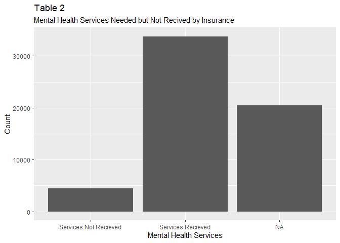

Midterm
================
Camille Parchment
2022-10-21

    ## ── Attaching packages ─────────────────────────────────────── tidyverse 1.3.2 ──
    ## ✔ ggplot2 3.3.6     ✔ purrr   0.3.4
    ## ✔ tibble  3.1.8     ✔ dplyr   1.0.9
    ## ✔ tidyr   1.2.0     ✔ stringr 1.4.1
    ## ✔ readr   2.1.2     ✔ forcats 0.5.2
    ## ── Conflicts ────────────────────────────────────────── tidyverse_conflicts() ──
    ## ✖ dplyr::between()   masks data.table::between()
    ## ✖ dplyr::filter()    masks stats::filter()
    ## ✖ dplyr::first()     masks data.table::first()
    ## ✖ dplyr::lag()       masks stats::lag()
    ## ✖ dplyr::last()      masks data.table::last()
    ## ✖ purrr::transpose() masks data.table::transpose()

## Introduction

#### During the COVID-19 pandemic, mental health services were disrupted, causing profound consequences for individuals in need of consistent mental health care. The pandemic exacerbated the need for mental health services which expanded an existing unmet demand. In addition to a shortage of mental health professionals, mental health providers needed to adjust service delivery to comply with safety protocols, which further inhibited access to care for some individuals. Further, at the onset of the pandemic, several state and local governments issued stay-at-home orders to reduce viral spread. These orders resulted in increased emotional distress e.g., anxiety, depression, and loss of employment. Employers are the leading providers of health insurance in the United States, suggesting that newly unemployed individuals may have lost access to secure healthcare coverage. The growing demand for mental health services, possible reduction in coverage, and changing delivery systems, may have decreased access to necessary mental health services during the COVID-19 pandemic. Therefore, the primary aim of this study is to establish insurance-related patterns of mental healthcare utilization. Specifically, did the absence of health insurance decrease access to mental health services during the COVID-19 pandemic?

## Methods

### Database

#### The Household Pulse Survey (HPS) is a self-report online survey which measures in real time the social and economic impacts of the COVID-19 pandemic. In this study we analyzed HPS data from week 18, October 28, 2021 – November 9, 2021.

### Sample

#### Our study sample were all individuals who needed mental health services and either received services or did not between October 28, 2021, and November 9, 2021. Mental health services were Our insurance variable was coded for both private and public insurance, public insurance only, private insurance only, or none. Region was coded for Midwest, Northeast, South, and West depending on the census region. I subset the data from the larger data frame to include only the variables relevant to the study question (Identification number, gender, region, public health insurance, private health insurance, marital status, mental health service received, mental health service not received). We recoded the missing (-99) and non-answered (-88, 3) responses as NA in all variables.

    ## region_2
    ##   Midwest Northeast     South      West 
    ##      8025      5566     11505     13164

    ## [1] "South" NA      "South" "South" "South" "South"

<!-- --><!-- -->

<!-- -->

    ## insurance
    ##                   both           No Insurance Private insurance only 
    ##                   7773                   2709                  22219 
    ##  Public insurance only                   <NA> 
    ##                   5559                  20469

<!-- -->

    ## 
    ## Attaching package: 'kableExtra'

    ## The following object is masked from 'package:dplyr':
    ## 
    ##     group_rows

    ## Warning: package 'kableExtra' is in use and will not be installed

    ## Warning in remove(public_insurance): object 'public_insurance' not found
