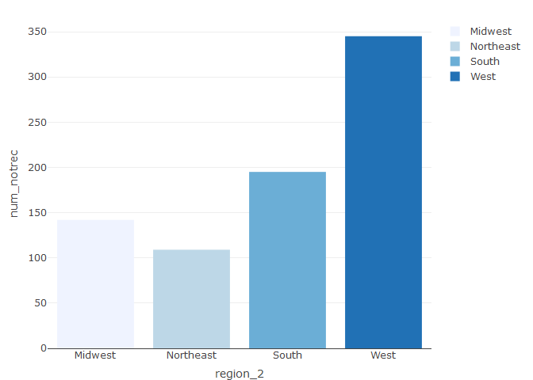
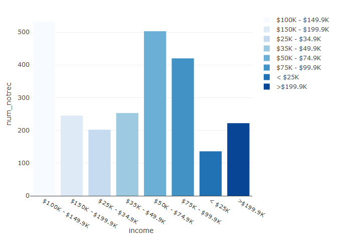

Midterm
================
Camille Parchment
2022-11-29

``` r
rm(list = ls())
```

    ## Warning: package 'data.table' was built under R version 4.2.2

    ## ── Attaching packages ─────────────────────────────────────── tidyverse 1.3.2 ──
    ## ✔ ggplot2 3.3.6     ✔ purrr   0.3.4
    ## ✔ tibble  3.1.8     ✔ dplyr   1.0.9
    ## ✔ tidyr   1.2.0     ✔ stringr 1.4.1
    ## ✔ readr   2.1.2     ✔ forcats 0.5.2
    ## ── Conflicts ────────────────────────────────────────── tidyverse_conflicts() ──
    ## ✖ dplyr::between()   masks data.table::between()
    ## ✖ dplyr::filter()    masks stats::filter()
    ## ✖ dplyr::first()     masks data.table::first()
    ## ✖ dplyr::lag()       masks stats::lag()
    ## ✖ dplyr::last()      masks data.table::last()
    ## ✖ purrr::transpose() masks data.table::transpose()

``` r
MHdf_2$income <- ifelse(MHdf_2$INCOME == "1", "< $25K",
                        ifelse(MHdf_2$INCOME == "2", "$25K - $34.9K",
                        ifelse(MHdf_2$INCOME == "3", "$35K - $49.9K",
                        ifelse(MHdf_2$INCOME == "4", "$50K - $74.9K",
                        ifelse(MHdf_2$INCOME == "5", "$75K - $99.9K", 
                        ifelse(MHdf_2$INCOME == "6", "$100K - $149.9K",
                        ifelse(MHdf_2$INCOME == "7", "$150K - $199.9K", ">$199.9K") 
                          
                        ))))))
```

``` r
MHdf_2$state <- ifelse(MHdf_2$EST_ST == "1","Alabama",
                ifelse(MHdf_2$EST_ST == "2", "Alaska",  
                ifelse(MHdf_2$EST_ST == "4", "Arizona", 
                ifelse(MHdf_2$EST_ST == "5", "Arkansas",
                ifelse(MHdf_2$EST_ST == "6", "California", 
                ifelse(MHdf_2$EST_ST == "8", "Colorado", 
                ifelse(MHdf_2$EST_ST == "9", "Connecticut", 
                ifelse(MHdf_2$EST_ST == "10","Delaware",
                ifelse(MHdf_2$EST_ST == "11", "District of Columbia", 
                ifelse(MHdf_2$EST_ST == "12", "Florida",     
                ifelse(MHdf_2$EST_ST == "13", "Georgia",
                ifelse(MHdf_2$EST_ST == "15", "Hawaii", 
                ifelse(MHdf_2$EST_ST == "16", "Idaho",
                ifelse(MHdf_2$EST_ST == "17", "Illinois", 
                ifelse(MHdf_2$EST_ST == "18", "Indiana",
                ifelse(MHdf_2$EST_ST == "19", "Iowa", 
                ifelse(MHdf_2$EST_ST == "20", "Kansas", 
                ifelse(MHdf_2$EST_ST == "21", "Kentucky", 
                ifelse(MHdf_2$EST_ST == "22", "Louisiana", 
                ifelse(MHdf_2$EST_ST == "23", "Maine", 
                ifelse(MHdf_2$EST_ST == "24", "Maryland", 
                ifelse(MHdf_2$EST_ST == "25", "Massachusetts", 
                ifelse(MHdf_2$EST_ST == "26", "Michigan", 
                ifelse(MHdf_2$EST_ST == "27", "Minnesota", 
                ifelse(MHdf_2$EST_ST == "28", "Mississippi", 
                ifelse(MHdf_2$EST_ST == "29", "Missouri", 
                ifelse(MHdf_2$EST_ST == "30", "Montana",
                ifelse(MHdf_2$EST_ST == "31", "Nebraska",
                ifelse(MHdf_2$EST_ST == "32", "Nevada", 
                ifelse(MHdf_2$EST_ST == "33", "New Hampshire",
                ifelse(MHdf_2$EST_ST == "34", "New Jersey",
                ifelse(MHdf_2$EST_ST == "35", "New Mexico",
                ifelse(MHdf_2$EST_ST == "36", "New York",
                ifelse(MHdf_2$EST_ST == "37", "North Carolina", 
                ifelse(MHdf_2$EST_ST == "38", "North Dakota", 
                ifelse(MHdf_2$EST_ST == "39", "Ohio",
                ifelse(MHdf_2$EST_ST == "40", "Oklahoma",
                ifelse(MHdf_2$EST_ST == "41", "Oregon",
                ifelse(MHdf_2$EST_ST == "42", "Pennsylvania",
                ifelse(MHdf_2$EST_ST == "44", "Rhode Island",
                ifelse(MHdf_2$EST_ST == "45", "South Carolina",
                ifelse(MHdf_2$EST_ST == "46", "South Dakota",
                ifelse(MHdf_2$EST_ST == "47", "Tennessee",
                ifelse(MHdf_2$EST_ST == "48", "Texas",
                ifelse(MHdf_2$EST_ST == "49", "Utah",
                ifelse(MHdf_2$EST_ST == "50", "Vermont",
                ifelse(MHdf_2$EST_ST == "51", "Virginia",
                ifelse(MHdf_2$EST_ST == "53", "Washington",
                ifelse(MHdf_2$EST_ST == "54", "West Virgina",
                ifelse(MHdf_2$EST_ST == "55", "Wisconsin", "Wyoming"
                      ))))))))))))))))))))))))))))))))))))))))))))))))))
                    table(MHdf_2$state, useNA = "always")
```

    ## 
    ##              Alabama               Alaska              Arizona 
    ##                  478                  959                 1080 
    ##             Arkansas           California             Colorado 
    ##                  502                 2748                 1182 
    ##          Connecticut             Delaware District of Columbia 
    ##                  595                  432                  508 
    ##              Florida              Georgia               Hawaii 
    ##                 1326                  789                  431 
    ##                Idaho             Illinois              Indiana 
    ##                  801                  989                  776 
    ##                 Iowa               Kansas             Kentucky 
    ##                  670                  712                  537 
    ##            Louisiana                Maine             Maryland 
    ##                  448                  337                  954 
    ##        Massachusetts             Michigan            Minnesota 
    ##                 1076                  837                  935 
    ##          Mississippi             Missouri              Montana 
    ##                  290                  631                  475 
    ##             Nebraska               Nevada        New Hampshire 
    ##                  607                  613                  571 
    ##           New Jersey           New Mexico             New York 
    ##                  667                  796                  803 
    ##       North Carolina         North Dakota                 Ohio 
    ##                  614                  388                  593 
    ##             Oklahoma               Oregon         Pennsylvania 
    ##                  549                 1094                  951 
    ##         Rhode Island       South Carolina         South Dakota 
    ##                  402                  525                  448 
    ##            Tennessee                Texas                 Utah 
    ##                  642                 1922                 1532 
    ##              Vermont             Virginia           Washington 
    ##                  422                 1017                 1592 
    ##         West Virgina            Wisconsin              Wyoming 
    ##                  385                  686                  461 
    ##                 <NA> 
    ##                    0

    ## 
    ##                   Both           No Insurance Private insurance only 
    ##                   9613                   2641                  21890 
    ##  Public insurance only                   <NA> 
    ##                   5634                      0

    ##                        
    ##                              Both No Insurance Private insurance only
    ##   Services Not Recieved  1.799990     1.390216               6.317562
    ##   Services Recieved     22.366635     5.249133              48.712856
    ##                        
    ##                         Public insurance only
    ##   Services Not Recieved              1.988536
    ##   Services Recieved                 12.175072

    ##                        
    ##                          Both No Insurance Private insurance only
    ##   Services Not Recieved   716          553                   2513
    ##   Services Recieved      8897         2088                  19377
    ##                        
    ##                         Public insurance only
    ##   Services Not Recieved                   791
    ##   Services Recieved                      4843

``` r
DF2 <- MHdf_2 %>%
dplyr::mutate(MH_NOTGET = ifelse(MHdf_2$MH_NOTGET == "1",1,0)) %>%
  filter(MHdf_2$insurance == "Public insurance only") %>%
  group_by(state) %>%
  summarise(Total_sv_needed = n(),
            num_notrec = sum(MH_NOTGET)) %>%
  mutate(services_rec = Total_sv_needed - num_notrec, 
  Notrec_rate = num_notrec/Total_sv_needed)  
```

``` r
DF4 <- MHdf_2 %>%
dplyr::mutate(MH_NOTGET = ifelse(MHdf_2$MH_NOTGET == "1",1,0)) %>%
  filter(MHdf_2$insurance == "Private insurance only") %>%
  group_by(state) %>%
  summarise(Total_sv_needed = n(),
            num_notrec = sum(MH_NOTGET)) %>%
  mutate(services_rec = Total_sv_needed - num_notrec, 
  Notrec_rate = num_notrec/Total_sv_needed) 
```

``` r
DF_income_Pub <- MHdf_2 %>%
dplyr::mutate(MH_NOTGET = ifelse(MHdf_2$MH_NOTGET == "1",1,0)) %>%
  filter(MHdf_2$insurance == "Public insurance only") %>%
  group_by(income) %>%
  summarise(Total_sv_needed = n(),
            num_notrec = sum(MH_NOTGET)) %>%
  mutate(services_rec = Total_sv_needed - num_notrec, 
  Notrec_rate = num_notrec/Total_sv_needed)  
```

``` r
DF_income_Pri <- MHdf_2 %>%
dplyr::mutate(MH_NOTGET = ifelse(MHdf_2$MH_NOTGET == "1",1,0)) %>%
  filter(MHdf_2$insurance == "Private insurance only") %>%
  group_by(income) %>%
  summarise(Total_sv_needed = n(),
            num_notrec = sum(MH_NOTGET)) %>%
  mutate(services_rec = Total_sv_needed - num_notrec, 
  Notrec_rate = num_notrec/Total_sv_needed)
```

``` r
DF_region_Pri <- MHdf_2 %>%
dplyr::mutate(MH_NOTGET = ifelse(MHdf_2$MH_NOTGET == "1",1,0)) %>%
  filter(MHdf_2$insurance == "Private insurance only") %>%
  group_by(region_2) %>%
  summarise(Total_sv_needed = n(),
            num_notrec = sum(MH_NOTGET)) %>%
  mutate(services_rec = Total_sv_needed - num_notrec, 
  Notrec_rate = num_notrec/Total_sv_needed)
```

``` r
DF_region_Pub <- MHdf_2 %>%
dplyr::mutate(MH_NOTGET = ifelse(MHdf_2$MH_NOTGET == "1",1,0)) %>%
  filter(MHdf_2$insurance == "Public insurance only") %>%
  group_by(region_2) %>%
  summarise(Total_sv_needed = n(),
            num_notrec = sum(MH_NOTGET)) %>%
  mutate(services_rec = Total_sv_needed - num_notrec, 
  Notrec_rate = num_notrec/Total_sv_needed)
```

DF3 \<- MHdf_2 %\>% dplyr::mutate(MH_NOTGET =
ifelse(MHdf_2$MH_NOTGET == "1",1,0)) %>%  filter(MHdf_2$insurance ==
“Private insurance only”) %\>% group_by(state) %\>% summarise(num_sv =
n(), num_rec = sum(MH_NOTGET)) %\>% mutate(services_nr = num_sv -
num_rec, rec_rate = num_rec/num_sv)

DF5 \<- MHdf_2 %\>% dplyr::mutate(MH_NOTGET =
ifelse(MHdf_2$MH_NOTGET == "1",1,0)) %>%  filter(MHdf_2$insurance ==
“Public insurance only”) %\>% group_by(state) %\>% summarise(num_sv =
n(), num_rec = sum(MH_NOTGET)) %\>% mutate(services_nr = num_sv -
num_rec, rec_rate = services_nr/num_sv)

<!-- -->

<!-- -->
<!-- -->

``` r
if(!require(plotly)) install.packages("plotly", repos = "http://cran.us.r-project.org")
```

    ## Loading required package: plotly

    ## Warning: package 'plotly' was built under R version 4.2.2

    ## 
    ## Attaching package: 'plotly'

    ## The following object is masked from 'package:ggplot2':
    ## 
    ##     last_plot

    ## The following object is masked from 'package:stats':
    ## 
    ##     filter

    ## The following object is masked from 'package:graphics':
    ## 
    ##     layout

``` r
library(plotly)
```

``` r
DF4 %>% 
           plot_ly(x = ~Total_sv_needed, y = ~num_notrec, 
                   type = 'scatter',
                   mode = 'markers',
                   color = ~state,
                   colors = "Blues")
```

    ## Warning in RColorBrewer::brewer.pal(n, pal): n too large, allowed maximum for palette Blues is 9
    ## Returning the palette you asked for with that many colors

    ## Warning in RColorBrewer::brewer.pal(n, pal): n too large, allowed maximum for palette Blues is 9
    ## Returning the palette you asked for with that many colors

    ## Warning in RColorBrewer::brewer.pal(n, pal): n too large, allowed maximum for palette Blues is 9
    ## Returning the palette you asked for with that many colors

    ## Warning in RColorBrewer::brewer.pal(n, pal): n too large, allowed maximum for palette Blues is 9
    ## Returning the palette you asked for with that many colors

    ## Warning in RColorBrewer::brewer.pal(n, pal): n too large, allowed maximum for palette Blues is 9
    ## Returning the palette you asked for with that many colors

    ## Warning in RColorBrewer::brewer.pal(n, pal): n too large, allowed maximum for palette Blues is 9
    ## Returning the palette you asked for with that many colors

    ## Warning in RColorBrewer::brewer.pal(n, pal): n too large, allowed maximum for palette Blues is 9
    ## Returning the palette you asked for with that many colors

    ## Warning in RColorBrewer::brewer.pal(n, pal): n too large, allowed maximum for palette Blues is 9
    ## Returning the palette you asked for with that many colors

    ## Warning in RColorBrewer::brewer.pal(n, pal): n too large, allowed maximum for palette Blues is 9
    ## Returning the palette you asked for with that many colors

    ## Warning in RColorBrewer::brewer.pal(n, pal): n too large, allowed maximum for palette Blues is 9
    ## Returning the palette you asked for with that many colors

    ## Warning in RColorBrewer::brewer.pal(n, pal): n too large, allowed maximum for palette Blues is 9
    ## Returning the palette you asked for with that many colors

    ## Warning in RColorBrewer::brewer.pal(n, pal): n too large, allowed maximum for palette Blues is 9
    ## Returning the palette you asked for with that many colors

    ## Warning in RColorBrewer::brewer.pal(n, pal): n too large, allowed maximum for palette Blues is 9
    ## Returning the palette you asked for with that many colors

    ## Warning in RColorBrewer::brewer.pal(n, pal): n too large, allowed maximum for palette Blues is 9
    ## Returning the palette you asked for with that many colors

    ## Warning in RColorBrewer::brewer.pal(n, pal): n too large, allowed maximum for palette Blues is 9
    ## Returning the palette you asked for with that many colors

    ## Warning in RColorBrewer::brewer.pal(n, pal): n too large, allowed maximum for palette Blues is 9
    ## Returning the palette you asked for with that many colors

    ## Warning in RColorBrewer::brewer.pal(n, pal): n too large, allowed maximum for palette Blues is 9
    ## Returning the palette you asked for with that many colors

    ## Warning in RColorBrewer::brewer.pal(n, pal): n too large, allowed maximum for palette Blues is 9
    ## Returning the palette you asked for with that many colors

    ## Warning in RColorBrewer::brewer.pal(n, pal): n too large, allowed maximum for palette Blues is 9
    ## Returning the palette you asked for with that many colors

    ## Warning in RColorBrewer::brewer.pal(n, pal): n too large, allowed maximum for palette Blues is 9
    ## Returning the palette you asked for with that many colors

    ## Warning in RColorBrewer::brewer.pal(n, pal): n too large, allowed maximum for palette Blues is 9
    ## Returning the palette you asked for with that many colors

    ## Warning in RColorBrewer::brewer.pal(n, pal): n too large, allowed maximum for palette Blues is 9
    ## Returning the palette you asked for with that many colors

    ## Warning in RColorBrewer::brewer.pal(n, pal): n too large, allowed maximum for palette Blues is 9
    ## Returning the palette you asked for with that many colors

    ## Warning in RColorBrewer::brewer.pal(n, pal): n too large, allowed maximum for palette Blues is 9
    ## Returning the palette you asked for with that many colors

    ## Warning in RColorBrewer::brewer.pal(n, pal): n too large, allowed maximum for palette Blues is 9
    ## Returning the palette you asked for with that many colors

    ## Warning in RColorBrewer::brewer.pal(n, pal): n too large, allowed maximum for palette Blues is 9
    ## Returning the palette you asked for with that many colors

    ## Warning in RColorBrewer::brewer.pal(n, pal): n too large, allowed maximum for palette Blues is 9
    ## Returning the palette you asked for with that many colors

    ## Warning in RColorBrewer::brewer.pal(n, pal): n too large, allowed maximum for palette Blues is 9
    ## Returning the palette you asked for with that many colors

    ## Warning in RColorBrewer::brewer.pal(n, pal): n too large, allowed maximum for palette Blues is 9
    ## Returning the palette you asked for with that many colors

    ## Warning in RColorBrewer::brewer.pal(n, pal): n too large, allowed maximum for palette Blues is 9
    ## Returning the palette you asked for with that many colors

    ## Warning in RColorBrewer::brewer.pal(n, pal): n too large, allowed maximum for palette Blues is 9
    ## Returning the palette you asked for with that many colors

    ## Warning in RColorBrewer::brewer.pal(n, pal): n too large, allowed maximum for palette Blues is 9
    ## Returning the palette you asked for with that many colors

    ## Warning in RColorBrewer::brewer.pal(n, pal): n too large, allowed maximum for palette Blues is 9
    ## Returning the palette you asked for with that many colors

    ## Warning in RColorBrewer::brewer.pal(n, pal): n too large, allowed maximum for palette Blues is 9
    ## Returning the palette you asked for with that many colors

    ## Warning in RColorBrewer::brewer.pal(n, pal): n too large, allowed maximum for palette Blues is 9
    ## Returning the palette you asked for with that many colors

    ## Warning in RColorBrewer::brewer.pal(n, pal): n too large, allowed maximum for palette Blues is 9
    ## Returning the palette you asked for with that many colors

    ## Warning in RColorBrewer::brewer.pal(n, pal): n too large, allowed maximum for palette Blues is 9
    ## Returning the palette you asked for with that many colors

    ## Warning in RColorBrewer::brewer.pal(n, pal): n too large, allowed maximum for palette Blues is 9
    ## Returning the palette you asked for with that many colors

    ## Warning in RColorBrewer::brewer.pal(n, pal): n too large, allowed maximum for palette Blues is 9
    ## Returning the palette you asked for with that many colors

    ## Warning in RColorBrewer::brewer.pal(n, pal): n too large, allowed maximum for palette Blues is 9
    ## Returning the palette you asked for with that many colors

    ## Warning in RColorBrewer::brewer.pal(n, pal): n too large, allowed maximum for palette Blues is 9
    ## Returning the palette you asked for with that many colors

    ## Warning in RColorBrewer::brewer.pal(n, pal): n too large, allowed maximum for palette Blues is 9
    ## Returning the palette you asked for with that many colors

    ## Warning in RColorBrewer::brewer.pal(n, pal): n too large, allowed maximum for palette Blues is 9
    ## Returning the palette you asked for with that many colors

    ## Warning in RColorBrewer::brewer.pal(n, pal): n too large, allowed maximum for palette Blues is 9
    ## Returning the palette you asked for with that many colors

    ## Warning in RColorBrewer::brewer.pal(n, pal): n too large, allowed maximum for palette Blues is 9
    ## Returning the palette you asked for with that many colors

    ## Warning in RColorBrewer::brewer.pal(n, pal): n too large, allowed maximum for palette Blues is 9
    ## Returning the palette you asked for with that many colors

    ## Warning in RColorBrewer::brewer.pal(n, pal): n too large, allowed maximum for palette Blues is 9
    ## Returning the palette you asked for with that many colors

    ## Warning in RColorBrewer::brewer.pal(n, pal): n too large, allowed maximum for palette Blues is 9
    ## Returning the palette you asked for with that many colors

    ## Warning in RColorBrewer::brewer.pal(n, pal): n too large, allowed maximum for palette Blues is 9
    ## Returning the palette you asked for with that many colors

    ## Warning in RColorBrewer::brewer.pal(n, pal): n too large, allowed maximum for palette Blues is 9
    ## Returning the palette you asked for with that many colors

    ## Warning in RColorBrewer::brewer.pal(n, pal): n too large, allowed maximum for palette Blues is 9
    ## Returning the palette you asked for with that many colors

    ## Warning in RColorBrewer::brewer.pal(n, pal): n too large, allowed maximum for palette Blues is 9
    ## Returning the palette you asked for with that many colors

    ## Warning in RColorBrewer::brewer.pal(n, pal): n too large, allowed maximum for palette Blues is 9
    ## Returning the palette you asked for with that many colors

    ## Warning in RColorBrewer::brewer.pal(n, pal): n too large, allowed maximum for palette Blues is 9
    ## Returning the palette you asked for with that many colors

    ## Warning in RColorBrewer::brewer.pal(n, pal): n too large, allowed maximum for palette Blues is 9
    ## Returning the palette you asked for with that many colors

    ## Warning in RColorBrewer::brewer.pal(n, pal): n too large, allowed maximum for palette Blues is 9
    ## Returning the palette you asked for with that many colors

    ## Warning in RColorBrewer::brewer.pal(n, pal): n too large, allowed maximum for palette Blues is 9
    ## Returning the palette you asked for with that many colors

    ## Warning in RColorBrewer::brewer.pal(n, pal): n too large, allowed maximum for palette Blues is 9
    ## Returning the palette you asked for with that many colors

    ## Warning in RColorBrewer::brewer.pal(n, pal): n too large, allowed maximum for palette Blues is 9
    ## Returning the palette you asked for with that many colors

    ## Warning in RColorBrewer::brewer.pal(n, pal): n too large, allowed maximum for palette Blues is 9
    ## Returning the palette you asked for with that many colors

    ## Warning in RColorBrewer::brewer.pal(n, pal): n too large, allowed maximum for palette Blues is 9
    ## Returning the palette you asked for with that many colors

    ## Warning in RColorBrewer::brewer.pal(n, pal): n too large, allowed maximum for palette Blues is 9
    ## Returning the palette you asked for with that many colors

    ## Warning in RColorBrewer::brewer.pal(n, pal): n too large, allowed maximum for palette Blues is 9
    ## Returning the palette you asked for with that many colors

    ## Warning in RColorBrewer::brewer.pal(n, pal): n too large, allowed maximum for palette Blues is 9
    ## Returning the palette you asked for with that many colors

    ## Warning in RColorBrewer::brewer.pal(n, pal): n too large, allowed maximum for palette Blues is 9
    ## Returning the palette you asked for with that many colors

    ## Warning in RColorBrewer::brewer.pal(n, pal): n too large, allowed maximum for palette Blues is 9
    ## Returning the palette you asked for with that many colors

    ## Warning in RColorBrewer::brewer.pal(n, pal): n too large, allowed maximum for palette Blues is 9
    ## Returning the palette you asked for with that many colors

    ## Warning in RColorBrewer::brewer.pal(n, pal): n too large, allowed maximum for palette Blues is 9
    ## Returning the palette you asked for with that many colors

    ## Warning in RColorBrewer::brewer.pal(n, pal): n too large, allowed maximum for palette Blues is 9
    ## Returning the palette you asked for with that many colors

    ## Warning in RColorBrewer::brewer.pal(n, pal): n too large, allowed maximum for palette Blues is 9
    ## Returning the palette you asked for with that many colors

    ## Warning in RColorBrewer::brewer.pal(n, pal): n too large, allowed maximum for palette Blues is 9
    ## Returning the palette you asked for with that many colors

    ## Warning in RColorBrewer::brewer.pal(n, pal): n too large, allowed maximum for palette Blues is 9
    ## Returning the palette you asked for with that many colors

    ## Warning in RColorBrewer::brewer.pal(n, pal): n too large, allowed maximum for palette Blues is 9
    ## Returning the palette you asked for with that many colors

    ## Warning in RColorBrewer::brewer.pal(n, pal): n too large, allowed maximum for palette Blues is 9
    ## Returning the palette you asked for with that many colors

    ## Warning in RColorBrewer::brewer.pal(n, pal): n too large, allowed maximum for palette Blues is 9
    ## Returning the palette you asked for with that many colors

    ## Warning in RColorBrewer::brewer.pal(n, pal): n too large, allowed maximum for palette Blues is 9
    ## Returning the palette you asked for with that many colors

    ## Warning in RColorBrewer::brewer.pal(n, pal): n too large, allowed maximum for palette Blues is 9
    ## Returning the palette you asked for with that many colors

    ## Warning in RColorBrewer::brewer.pal(n, pal): n too large, allowed maximum for palette Blues is 9
    ## Returning the palette you asked for with that many colors

    ## Warning in RColorBrewer::brewer.pal(n, pal): n too large, allowed maximum for palette Blues is 9
    ## Returning the palette you asked for with that many colors

    ## Warning in RColorBrewer::brewer.pal(n, pal): n too large, allowed maximum for palette Blues is 9
    ## Returning the palette you asked for with that many colors

    ## Warning in RColorBrewer::brewer.pal(n, pal): n too large, allowed maximum for palette Blues is 9
    ## Returning the palette you asked for with that many colors

    ## Warning in RColorBrewer::brewer.pal(n, pal): n too large, allowed maximum for palette Blues is 9
    ## Returning the palette you asked for with that many colors

    ## Warning in RColorBrewer::brewer.pal(n, pal): n too large, allowed maximum for palette Blues is 9
    ## Returning the palette you asked for with that many colors

    ## Warning in RColorBrewer::brewer.pal(n, pal): n too large, allowed maximum for palette Blues is 9
    ## Returning the palette you asked for with that many colors

    ## Warning in RColorBrewer::brewer.pal(n, pal): n too large, allowed maximum for palette Blues is 9
    ## Returning the palette you asked for with that many colors

    ## Warning in RColorBrewer::brewer.pal(n, pal): n too large, allowed maximum for palette Blues is 9
    ## Returning the palette you asked for with that many colors

    ## Warning in RColorBrewer::brewer.pal(n, pal): n too large, allowed maximum for palette Blues is 9
    ## Returning the palette you asked for with that many colors

    ## Warning in RColorBrewer::brewer.pal(n, pal): n too large, allowed maximum for palette Blues is 9
    ## Returning the palette you asked for with that many colors

    ## Warning in RColorBrewer::brewer.pal(n, pal): n too large, allowed maximum for palette Blues is 9
    ## Returning the palette you asked for with that many colors

    ## Warning in RColorBrewer::brewer.pal(n, pal): n too large, allowed maximum for palette Blues is 9
    ## Returning the palette you asked for with that many colors

    ## Warning in RColorBrewer::brewer.pal(n, pal): n too large, allowed maximum for palette Blues is 9
    ## Returning the palette you asked for with that many colors

    ## Warning in RColorBrewer::brewer.pal(n, pal): n too large, allowed maximum for palette Blues is 9
    ## Returning the palette you asked for with that many colors

    ## Warning in RColorBrewer::brewer.pal(n, pal): n too large, allowed maximum for palette Blues is 9
    ## Returning the palette you asked for with that many colors

    ## Warning in RColorBrewer::brewer.pal(n, pal): n too large, allowed maximum for palette Blues is 9
    ## Returning the palette you asked for with that many colors

    ## Warning in RColorBrewer::brewer.pal(n, pal): n too large, allowed maximum for palette Blues is 9
    ## Returning the palette you asked for with that many colors

    ## Warning in RColorBrewer::brewer.pal(n, pal): n too large, allowed maximum for palette Blues is 9
    ## Returning the palette you asked for with that many colors

    ## Warning in RColorBrewer::brewer.pal(n, pal): n too large, allowed maximum for palette Blues is 9
    ## Returning the palette you asked for with that many colors

    ## Warning in RColorBrewer::brewer.pal(n, pal): n too large, allowed maximum for palette Blues is 9
    ## Returning the palette you asked for with that many colors

    ## Warning in RColorBrewer::brewer.pal(n, pal): n too large, allowed maximum for palette Blues is 9
    ## Returning the palette you asked for with that many colors

    ## Warning in RColorBrewer::brewer.pal(n, pal): n too large, allowed maximum for palette Blues is 9
    ## Returning the palette you asked for with that many colors

    ## Warning in RColorBrewer::brewer.pal(n, pal): n too large, allowed maximum for palette Blues is 9
    ## Returning the palette you asked for with that many colors

    ## Warning in RColorBrewer::brewer.pal(n, pal): n too large, allowed maximum for palette Blues is 9
    ## Returning the palette you asked for with that many colors

<!-- -->

``` r
DF2 %>% 
           plot_ly(x = ~Total_sv_needed, y = ~num_notrec, 
                   type = 'scatter',
                   mode = 'markers',
                   color = ~state,
                   colors = "Purples")
```

    ## Warning in RColorBrewer::brewer.pal(n, pal): n too large, allowed maximum for palette Purples is 9
    ## Returning the palette you asked for with that many colors

    ## Warning in RColorBrewer::brewer.pal(n, pal): n too large, allowed maximum for palette Purples is 9
    ## Returning the palette you asked for with that many colors

    ## Warning in RColorBrewer::brewer.pal(n, pal): n too large, allowed maximum for palette Purples is 9
    ## Returning the palette you asked for with that many colors

    ## Warning in RColorBrewer::brewer.pal(n, pal): n too large, allowed maximum for palette Purples is 9
    ## Returning the palette you asked for with that many colors

    ## Warning in RColorBrewer::brewer.pal(n, pal): n too large, allowed maximum for palette Purples is 9
    ## Returning the palette you asked for with that many colors

    ## Warning in RColorBrewer::brewer.pal(n, pal): n too large, allowed maximum for palette Purples is 9
    ## Returning the palette you asked for with that many colors

    ## Warning in RColorBrewer::brewer.pal(n, pal): n too large, allowed maximum for palette Purples is 9
    ## Returning the palette you asked for with that many colors

    ## Warning in RColorBrewer::brewer.pal(n, pal): n too large, allowed maximum for palette Purples is 9
    ## Returning the palette you asked for with that many colors

    ## Warning in RColorBrewer::brewer.pal(n, pal): n too large, allowed maximum for palette Purples is 9
    ## Returning the palette you asked for with that many colors

    ## Warning in RColorBrewer::brewer.pal(n, pal): n too large, allowed maximum for palette Purples is 9
    ## Returning the palette you asked for with that many colors

    ## Warning in RColorBrewer::brewer.pal(n, pal): n too large, allowed maximum for palette Purples is 9
    ## Returning the palette you asked for with that many colors

    ## Warning in RColorBrewer::brewer.pal(n, pal): n too large, allowed maximum for palette Purples is 9
    ## Returning the palette you asked for with that many colors

    ## Warning in RColorBrewer::brewer.pal(n, pal): n too large, allowed maximum for palette Purples is 9
    ## Returning the palette you asked for with that many colors

    ## Warning in RColorBrewer::brewer.pal(n, pal): n too large, allowed maximum for palette Purples is 9
    ## Returning the palette you asked for with that many colors

    ## Warning in RColorBrewer::brewer.pal(n, pal): n too large, allowed maximum for palette Purples is 9
    ## Returning the palette you asked for with that many colors

    ## Warning in RColorBrewer::brewer.pal(n, pal): n too large, allowed maximum for palette Purples is 9
    ## Returning the palette you asked for with that many colors

    ## Warning in RColorBrewer::brewer.pal(n, pal): n too large, allowed maximum for palette Purples is 9
    ## Returning the palette you asked for with that many colors

    ## Warning in RColorBrewer::brewer.pal(n, pal): n too large, allowed maximum for palette Purples is 9
    ## Returning the palette you asked for with that many colors

    ## Warning in RColorBrewer::brewer.pal(n, pal): n too large, allowed maximum for palette Purples is 9
    ## Returning the palette you asked for with that many colors

    ## Warning in RColorBrewer::brewer.pal(n, pal): n too large, allowed maximum for palette Purples is 9
    ## Returning the palette you asked for with that many colors

    ## Warning in RColorBrewer::brewer.pal(n, pal): n too large, allowed maximum for palette Purples is 9
    ## Returning the palette you asked for with that many colors

    ## Warning in RColorBrewer::brewer.pal(n, pal): n too large, allowed maximum for palette Purples is 9
    ## Returning the palette you asked for with that many colors

    ## Warning in RColorBrewer::brewer.pal(n, pal): n too large, allowed maximum for palette Purples is 9
    ## Returning the palette you asked for with that many colors

    ## Warning in RColorBrewer::brewer.pal(n, pal): n too large, allowed maximum for palette Purples is 9
    ## Returning the palette you asked for with that many colors

    ## Warning in RColorBrewer::brewer.pal(n, pal): n too large, allowed maximum for palette Purples is 9
    ## Returning the palette you asked for with that many colors

    ## Warning in RColorBrewer::brewer.pal(n, pal): n too large, allowed maximum for palette Purples is 9
    ## Returning the palette you asked for with that many colors

    ## Warning in RColorBrewer::brewer.pal(n, pal): n too large, allowed maximum for palette Purples is 9
    ## Returning the palette you asked for with that many colors

    ## Warning in RColorBrewer::brewer.pal(n, pal): n too large, allowed maximum for palette Purples is 9
    ## Returning the palette you asked for with that many colors

    ## Warning in RColorBrewer::brewer.pal(n, pal): n too large, allowed maximum for palette Purples is 9
    ## Returning the palette you asked for with that many colors

    ## Warning in RColorBrewer::brewer.pal(n, pal): n too large, allowed maximum for palette Purples is 9
    ## Returning the palette you asked for with that many colors

    ## Warning in RColorBrewer::brewer.pal(n, pal): n too large, allowed maximum for palette Purples is 9
    ## Returning the palette you asked for with that many colors

    ## Warning in RColorBrewer::brewer.pal(n, pal): n too large, allowed maximum for palette Purples is 9
    ## Returning the palette you asked for with that many colors

    ## Warning in RColorBrewer::brewer.pal(n, pal): n too large, allowed maximum for palette Purples is 9
    ## Returning the palette you asked for with that many colors

    ## Warning in RColorBrewer::brewer.pal(n, pal): n too large, allowed maximum for palette Purples is 9
    ## Returning the palette you asked for with that many colors

    ## Warning in RColorBrewer::brewer.pal(n, pal): n too large, allowed maximum for palette Purples is 9
    ## Returning the palette you asked for with that many colors

    ## Warning in RColorBrewer::brewer.pal(n, pal): n too large, allowed maximum for palette Purples is 9
    ## Returning the palette you asked for with that many colors

    ## Warning in RColorBrewer::brewer.pal(n, pal): n too large, allowed maximum for palette Purples is 9
    ## Returning the palette you asked for with that many colors

    ## Warning in RColorBrewer::brewer.pal(n, pal): n too large, allowed maximum for palette Purples is 9
    ## Returning the palette you asked for with that many colors

    ## Warning in RColorBrewer::brewer.pal(n, pal): n too large, allowed maximum for palette Purples is 9
    ## Returning the palette you asked for with that many colors

    ## Warning in RColorBrewer::brewer.pal(n, pal): n too large, allowed maximum for palette Purples is 9
    ## Returning the palette you asked for with that many colors

    ## Warning in RColorBrewer::brewer.pal(n, pal): n too large, allowed maximum for palette Purples is 9
    ## Returning the palette you asked for with that many colors

    ## Warning in RColorBrewer::brewer.pal(n, pal): n too large, allowed maximum for palette Purples is 9
    ## Returning the palette you asked for with that many colors

    ## Warning in RColorBrewer::brewer.pal(n, pal): n too large, allowed maximum for palette Purples is 9
    ## Returning the palette you asked for with that many colors

    ## Warning in RColorBrewer::brewer.pal(n, pal): n too large, allowed maximum for palette Purples is 9
    ## Returning the palette you asked for with that many colors

    ## Warning in RColorBrewer::brewer.pal(n, pal): n too large, allowed maximum for palette Purples is 9
    ## Returning the palette you asked for with that many colors

    ## Warning in RColorBrewer::brewer.pal(n, pal): n too large, allowed maximum for palette Purples is 9
    ## Returning the palette you asked for with that many colors

    ## Warning in RColorBrewer::brewer.pal(n, pal): n too large, allowed maximum for palette Purples is 9
    ## Returning the palette you asked for with that many colors

    ## Warning in RColorBrewer::brewer.pal(n, pal): n too large, allowed maximum for palette Purples is 9
    ## Returning the palette you asked for with that many colors

    ## Warning in RColorBrewer::brewer.pal(n, pal): n too large, allowed maximum for palette Purples is 9
    ## Returning the palette you asked for with that many colors

    ## Warning in RColorBrewer::brewer.pal(n, pal): n too large, allowed maximum for palette Purples is 9
    ## Returning the palette you asked for with that many colors

    ## Warning in RColorBrewer::brewer.pal(n, pal): n too large, allowed maximum for palette Purples is 9
    ## Returning the palette you asked for with that many colors

    ## Warning in RColorBrewer::brewer.pal(n, pal): n too large, allowed maximum for palette Purples is 9
    ## Returning the palette you asked for with that many colors

    ## Warning in RColorBrewer::brewer.pal(n, pal): n too large, allowed maximum for palette Purples is 9
    ## Returning the palette you asked for with that many colors

    ## Warning in RColorBrewer::brewer.pal(n, pal): n too large, allowed maximum for palette Purples is 9
    ## Returning the palette you asked for with that many colors

    ## Warning in RColorBrewer::brewer.pal(n, pal): n too large, allowed maximum for palette Purples is 9
    ## Returning the palette you asked for with that many colors

    ## Warning in RColorBrewer::brewer.pal(n, pal): n too large, allowed maximum for palette Purples is 9
    ## Returning the palette you asked for with that many colors

    ## Warning in RColorBrewer::brewer.pal(n, pal): n too large, allowed maximum for palette Purples is 9
    ## Returning the palette you asked for with that many colors

    ## Warning in RColorBrewer::brewer.pal(n, pal): n too large, allowed maximum for palette Purples is 9
    ## Returning the palette you asked for with that many colors

    ## Warning in RColorBrewer::brewer.pal(n, pal): n too large, allowed maximum for palette Purples is 9
    ## Returning the palette you asked for with that many colors

    ## Warning in RColorBrewer::brewer.pal(n, pal): n too large, allowed maximum for palette Purples is 9
    ## Returning the palette you asked for with that many colors

    ## Warning in RColorBrewer::brewer.pal(n, pal): n too large, allowed maximum for palette Purples is 9
    ## Returning the palette you asked for with that many colors

    ## Warning in RColorBrewer::brewer.pal(n, pal): n too large, allowed maximum for palette Purples is 9
    ## Returning the palette you asked for with that many colors

    ## Warning in RColorBrewer::brewer.pal(n, pal): n too large, allowed maximum for palette Purples is 9
    ## Returning the palette you asked for with that many colors

    ## Warning in RColorBrewer::brewer.pal(n, pal): n too large, allowed maximum for palette Purples is 9
    ## Returning the palette you asked for with that many colors

    ## Warning in RColorBrewer::brewer.pal(n, pal): n too large, allowed maximum for palette Purples is 9
    ## Returning the palette you asked for with that many colors

    ## Warning in RColorBrewer::brewer.pal(n, pal): n too large, allowed maximum for palette Purples is 9
    ## Returning the palette you asked for with that many colors

    ## Warning in RColorBrewer::brewer.pal(n, pal): n too large, allowed maximum for palette Purples is 9
    ## Returning the palette you asked for with that many colors

    ## Warning in RColorBrewer::brewer.pal(n, pal): n too large, allowed maximum for palette Purples is 9
    ## Returning the palette you asked for with that many colors

    ## Warning in RColorBrewer::brewer.pal(n, pal): n too large, allowed maximum for palette Purples is 9
    ## Returning the palette you asked for with that many colors

    ## Warning in RColorBrewer::brewer.pal(n, pal): n too large, allowed maximum for palette Purples is 9
    ## Returning the palette you asked for with that many colors

    ## Warning in RColorBrewer::brewer.pal(n, pal): n too large, allowed maximum for palette Purples is 9
    ## Returning the palette you asked for with that many colors

    ## Warning in RColorBrewer::brewer.pal(n, pal): n too large, allowed maximum for palette Purples is 9
    ## Returning the palette you asked for with that many colors

    ## Warning in RColorBrewer::brewer.pal(n, pal): n too large, allowed maximum for palette Purples is 9
    ## Returning the palette you asked for with that many colors

    ## Warning in RColorBrewer::brewer.pal(n, pal): n too large, allowed maximum for palette Purples is 9
    ## Returning the palette you asked for with that many colors

    ## Warning in RColorBrewer::brewer.pal(n, pal): n too large, allowed maximum for palette Purples is 9
    ## Returning the palette you asked for with that many colors

    ## Warning in RColorBrewer::brewer.pal(n, pal): n too large, allowed maximum for palette Purples is 9
    ## Returning the palette you asked for with that many colors

    ## Warning in RColorBrewer::brewer.pal(n, pal): n too large, allowed maximum for palette Purples is 9
    ## Returning the palette you asked for with that many colors

    ## Warning in RColorBrewer::brewer.pal(n, pal): n too large, allowed maximum for palette Purples is 9
    ## Returning the palette you asked for with that many colors

    ## Warning in RColorBrewer::brewer.pal(n, pal): n too large, allowed maximum for palette Purples is 9
    ## Returning the palette you asked for with that many colors

    ## Warning in RColorBrewer::brewer.pal(n, pal): n too large, allowed maximum for palette Purples is 9
    ## Returning the palette you asked for with that many colors

    ## Warning in RColorBrewer::brewer.pal(n, pal): n too large, allowed maximum for palette Purples is 9
    ## Returning the palette you asked for with that many colors

    ## Warning in RColorBrewer::brewer.pal(n, pal): n too large, allowed maximum for palette Purples is 9
    ## Returning the palette you asked for with that many colors

    ## Warning in RColorBrewer::brewer.pal(n, pal): n too large, allowed maximum for palette Purples is 9
    ## Returning the palette you asked for with that many colors

    ## Warning in RColorBrewer::brewer.pal(n, pal): n too large, allowed maximum for palette Purples is 9
    ## Returning the palette you asked for with that many colors

    ## Warning in RColorBrewer::brewer.pal(n, pal): n too large, allowed maximum for palette Purples is 9
    ## Returning the palette you asked for with that many colors

    ## Warning in RColorBrewer::brewer.pal(n, pal): n too large, allowed maximum for palette Purples is 9
    ## Returning the palette you asked for with that many colors

    ## Warning in RColorBrewer::brewer.pal(n, pal): n too large, allowed maximum for palette Purples is 9
    ## Returning the palette you asked for with that many colors

    ## Warning in RColorBrewer::brewer.pal(n, pal): n too large, allowed maximum for palette Purples is 9
    ## Returning the palette you asked for with that many colors

    ## Warning in RColorBrewer::brewer.pal(n, pal): n too large, allowed maximum for palette Purples is 9
    ## Returning the palette you asked for with that many colors

    ## Warning in RColorBrewer::brewer.pal(n, pal): n too large, allowed maximum for palette Purples is 9
    ## Returning the palette you asked for with that many colors

    ## Warning in RColorBrewer::brewer.pal(n, pal): n too large, allowed maximum for palette Purples is 9
    ## Returning the palette you asked for with that many colors

    ## Warning in RColorBrewer::brewer.pal(n, pal): n too large, allowed maximum for palette Purples is 9
    ## Returning the palette you asked for with that many colors

    ## Warning in RColorBrewer::brewer.pal(n, pal): n too large, allowed maximum for palette Purples is 9
    ## Returning the palette you asked for with that many colors

    ## Warning in RColorBrewer::brewer.pal(n, pal): n too large, allowed maximum for palette Purples is 9
    ## Returning the palette you asked for with that many colors

    ## Warning in RColorBrewer::brewer.pal(n, pal): n too large, allowed maximum for palette Purples is 9
    ## Returning the palette you asked for with that many colors

    ## Warning in RColorBrewer::brewer.pal(n, pal): n too large, allowed maximum for palette Purples is 9
    ## Returning the palette you asked for with that many colors

    ## Warning in RColorBrewer::brewer.pal(n, pal): n too large, allowed maximum for palette Purples is 9
    ## Returning the palette you asked for with that many colors

    ## Warning in RColorBrewer::brewer.pal(n, pal): n too large, allowed maximum for palette Purples is 9
    ## Returning the palette you asked for with that many colors

    ## Warning in RColorBrewer::brewer.pal(n, pal): n too large, allowed maximum for palette Purples is 9
    ## Returning the palette you asked for with that many colors

    ## Warning in RColorBrewer::brewer.pal(n, pal): n too large, allowed maximum for palette Purples is 9
    ## Returning the palette you asked for with that many colors

    ## Warning in RColorBrewer::brewer.pal(n, pal): n too large, allowed maximum for palette Purples is 9
    ## Returning the palette you asked for with that many colors

    ## Warning in RColorBrewer::brewer.pal(n, pal): n too large, allowed maximum for palette Purples is 9
    ## Returning the palette you asked for with that many colors

<!-- -->

``` r
DF_region_Pri %>%
  
plot_ly(x = ~region_2, y = ~num_notrec, 
                   type = 'bar',
                   mode = 'markers',
                   color = ~region_2,
                   colors = "Blues")
```

    ## Warning: 'bar' objects don't have these attributes: 'mode'
    ## Valid attributes include:
    ## '_deprecated', 'alignmentgroup', 'base', 'basesrc', 'cliponaxis', 'constraintext', 'customdata', 'customdatasrc', 'dx', 'dy', 'error_x', 'error_y', 'hoverinfo', 'hoverinfosrc', 'hoverlabel', 'hovertemplate', 'hovertemplatesrc', 'hovertext', 'hovertextsrc', 'ids', 'idssrc', 'insidetextanchor', 'insidetextfont', 'legendgroup', 'legendgrouptitle', 'legendrank', 'marker', 'meta', 'metasrc', 'name', 'offset', 'offsetgroup', 'offsetsrc', 'opacity', 'orientation', 'outsidetextfont', 'selected', 'selectedpoints', 'showlegend', 'stream', 'text', 'textangle', 'textfont', 'textposition', 'textpositionsrc', 'textsrc', 'texttemplate', 'texttemplatesrc', 'transforms', 'type', 'uid', 'uirevision', 'unselected', 'visible', 'width', 'widthsrc', 'x', 'x0', 'xaxis', 'xcalendar', 'xhoverformat', 'xperiod', 'xperiod0', 'xperiodalignment', 'xsrc', 'y', 'y0', 'yaxis', 'ycalendar', 'yhoverformat', 'yperiod', 'yperiod0', 'yperiodalignment', 'ysrc', 'key', 'set', 'frame', 'transforms', '_isNestedKey', '_isSimpleKey', '_isGraticule', '_bbox'

    ## Warning: 'bar' objects don't have these attributes: 'mode'
    ## Valid attributes include:
    ## '_deprecated', 'alignmentgroup', 'base', 'basesrc', 'cliponaxis', 'constraintext', 'customdata', 'customdatasrc', 'dx', 'dy', 'error_x', 'error_y', 'hoverinfo', 'hoverinfosrc', 'hoverlabel', 'hovertemplate', 'hovertemplatesrc', 'hovertext', 'hovertextsrc', 'ids', 'idssrc', 'insidetextanchor', 'insidetextfont', 'legendgroup', 'legendgrouptitle', 'legendrank', 'marker', 'meta', 'metasrc', 'name', 'offset', 'offsetgroup', 'offsetsrc', 'opacity', 'orientation', 'outsidetextfont', 'selected', 'selectedpoints', 'showlegend', 'stream', 'text', 'textangle', 'textfont', 'textposition', 'textpositionsrc', 'textsrc', 'texttemplate', 'texttemplatesrc', 'transforms', 'type', 'uid', 'uirevision', 'unselected', 'visible', 'width', 'widthsrc', 'x', 'x0', 'xaxis', 'xcalendar', 'xhoverformat', 'xperiod', 'xperiod0', 'xperiodalignment', 'xsrc', 'y', 'y0', 'yaxis', 'ycalendar', 'yhoverformat', 'yperiod', 'yperiod0', 'yperiodalignment', 'ysrc', 'key', 'set', 'frame', 'transforms', '_isNestedKey', '_isSimpleKey', '_isGraticule', '_bbox'

    ## Warning: 'bar' objects don't have these attributes: 'mode'
    ## Valid attributes include:
    ## '_deprecated', 'alignmentgroup', 'base', 'basesrc', 'cliponaxis', 'constraintext', 'customdata', 'customdatasrc', 'dx', 'dy', 'error_x', 'error_y', 'hoverinfo', 'hoverinfosrc', 'hoverlabel', 'hovertemplate', 'hovertemplatesrc', 'hovertext', 'hovertextsrc', 'ids', 'idssrc', 'insidetextanchor', 'insidetextfont', 'legendgroup', 'legendgrouptitle', 'legendrank', 'marker', 'meta', 'metasrc', 'name', 'offset', 'offsetgroup', 'offsetsrc', 'opacity', 'orientation', 'outsidetextfont', 'selected', 'selectedpoints', 'showlegend', 'stream', 'text', 'textangle', 'textfont', 'textposition', 'textpositionsrc', 'textsrc', 'texttemplate', 'texttemplatesrc', 'transforms', 'type', 'uid', 'uirevision', 'unselected', 'visible', 'width', 'widthsrc', 'x', 'x0', 'xaxis', 'xcalendar', 'xhoverformat', 'xperiod', 'xperiod0', 'xperiodalignment', 'xsrc', 'y', 'y0', 'yaxis', 'ycalendar', 'yhoverformat', 'yperiod', 'yperiod0', 'yperiodalignment', 'ysrc', 'key', 'set', 'frame', 'transforms', '_isNestedKey', '_isSimpleKey', '_isGraticule', '_bbox'

    ## Warning: 'bar' objects don't have these attributes: 'mode'
    ## Valid attributes include:
    ## '_deprecated', 'alignmentgroup', 'base', 'basesrc', 'cliponaxis', 'constraintext', 'customdata', 'customdatasrc', 'dx', 'dy', 'error_x', 'error_y', 'hoverinfo', 'hoverinfosrc', 'hoverlabel', 'hovertemplate', 'hovertemplatesrc', 'hovertext', 'hovertextsrc', 'ids', 'idssrc', 'insidetextanchor', 'insidetextfont', 'legendgroup', 'legendgrouptitle', 'legendrank', 'marker', 'meta', 'metasrc', 'name', 'offset', 'offsetgroup', 'offsetsrc', 'opacity', 'orientation', 'outsidetextfont', 'selected', 'selectedpoints', 'showlegend', 'stream', 'text', 'textangle', 'textfont', 'textposition', 'textpositionsrc', 'textsrc', 'texttemplate', 'texttemplatesrc', 'transforms', 'type', 'uid', 'uirevision', 'unselected', 'visible', 'width', 'widthsrc', 'x', 'x0', 'xaxis', 'xcalendar', 'xhoverformat', 'xperiod', 'xperiod0', 'xperiodalignment', 'xsrc', 'y', 'y0', 'yaxis', 'ycalendar', 'yhoverformat', 'yperiod', 'yperiod0', 'yperiodalignment', 'ysrc', 'key', 'set', 'frame', 'transforms', '_isNestedKey', '_isSimpleKey', '_isGraticule', '_bbox'

<!-- -->

``` r
DF_region_Pub %>%
  
plot_ly(x = ~region_2, y = ~num_notrec, 
                   type = 'bar',
                   mode = 'markers',
                   color = ~region_2,
                   colors = "Blues")
```

    ## Warning: 'bar' objects don't have these attributes: 'mode'
    ## Valid attributes include:
    ## '_deprecated', 'alignmentgroup', 'base', 'basesrc', 'cliponaxis', 'constraintext', 'customdata', 'customdatasrc', 'dx', 'dy', 'error_x', 'error_y', 'hoverinfo', 'hoverinfosrc', 'hoverlabel', 'hovertemplate', 'hovertemplatesrc', 'hovertext', 'hovertextsrc', 'ids', 'idssrc', 'insidetextanchor', 'insidetextfont', 'legendgroup', 'legendgrouptitle', 'legendrank', 'marker', 'meta', 'metasrc', 'name', 'offset', 'offsetgroup', 'offsetsrc', 'opacity', 'orientation', 'outsidetextfont', 'selected', 'selectedpoints', 'showlegend', 'stream', 'text', 'textangle', 'textfont', 'textposition', 'textpositionsrc', 'textsrc', 'texttemplate', 'texttemplatesrc', 'transforms', 'type', 'uid', 'uirevision', 'unselected', 'visible', 'width', 'widthsrc', 'x', 'x0', 'xaxis', 'xcalendar', 'xhoverformat', 'xperiod', 'xperiod0', 'xperiodalignment', 'xsrc', 'y', 'y0', 'yaxis', 'ycalendar', 'yhoverformat', 'yperiod', 'yperiod0', 'yperiodalignment', 'ysrc', 'key', 'set', 'frame', 'transforms', '_isNestedKey', '_isSimpleKey', '_isGraticule', '_bbox'

    ## Warning: 'bar' objects don't have these attributes: 'mode'
    ## Valid attributes include:
    ## '_deprecated', 'alignmentgroup', 'base', 'basesrc', 'cliponaxis', 'constraintext', 'customdata', 'customdatasrc', 'dx', 'dy', 'error_x', 'error_y', 'hoverinfo', 'hoverinfosrc', 'hoverlabel', 'hovertemplate', 'hovertemplatesrc', 'hovertext', 'hovertextsrc', 'ids', 'idssrc', 'insidetextanchor', 'insidetextfont', 'legendgroup', 'legendgrouptitle', 'legendrank', 'marker', 'meta', 'metasrc', 'name', 'offset', 'offsetgroup', 'offsetsrc', 'opacity', 'orientation', 'outsidetextfont', 'selected', 'selectedpoints', 'showlegend', 'stream', 'text', 'textangle', 'textfont', 'textposition', 'textpositionsrc', 'textsrc', 'texttemplate', 'texttemplatesrc', 'transforms', 'type', 'uid', 'uirevision', 'unselected', 'visible', 'width', 'widthsrc', 'x', 'x0', 'xaxis', 'xcalendar', 'xhoverformat', 'xperiod', 'xperiod0', 'xperiodalignment', 'xsrc', 'y', 'y0', 'yaxis', 'ycalendar', 'yhoverformat', 'yperiod', 'yperiod0', 'yperiodalignment', 'ysrc', 'key', 'set', 'frame', 'transforms', '_isNestedKey', '_isSimpleKey', '_isGraticule', '_bbox'

    ## Warning: 'bar' objects don't have these attributes: 'mode'
    ## Valid attributes include:
    ## '_deprecated', 'alignmentgroup', 'base', 'basesrc', 'cliponaxis', 'constraintext', 'customdata', 'customdatasrc', 'dx', 'dy', 'error_x', 'error_y', 'hoverinfo', 'hoverinfosrc', 'hoverlabel', 'hovertemplate', 'hovertemplatesrc', 'hovertext', 'hovertextsrc', 'ids', 'idssrc', 'insidetextanchor', 'insidetextfont', 'legendgroup', 'legendgrouptitle', 'legendrank', 'marker', 'meta', 'metasrc', 'name', 'offset', 'offsetgroup', 'offsetsrc', 'opacity', 'orientation', 'outsidetextfont', 'selected', 'selectedpoints', 'showlegend', 'stream', 'text', 'textangle', 'textfont', 'textposition', 'textpositionsrc', 'textsrc', 'texttemplate', 'texttemplatesrc', 'transforms', 'type', 'uid', 'uirevision', 'unselected', 'visible', 'width', 'widthsrc', 'x', 'x0', 'xaxis', 'xcalendar', 'xhoverformat', 'xperiod', 'xperiod0', 'xperiodalignment', 'xsrc', 'y', 'y0', 'yaxis', 'ycalendar', 'yhoverformat', 'yperiod', 'yperiod0', 'yperiodalignment', 'ysrc', 'key', 'set', 'frame', 'transforms', '_isNestedKey', '_isSimpleKey', '_isGraticule', '_bbox'

    ## Warning: 'bar' objects don't have these attributes: 'mode'
    ## Valid attributes include:
    ## '_deprecated', 'alignmentgroup', 'base', 'basesrc', 'cliponaxis', 'constraintext', 'customdata', 'customdatasrc', 'dx', 'dy', 'error_x', 'error_y', 'hoverinfo', 'hoverinfosrc', 'hoverlabel', 'hovertemplate', 'hovertemplatesrc', 'hovertext', 'hovertextsrc', 'ids', 'idssrc', 'insidetextanchor', 'insidetextfont', 'legendgroup', 'legendgrouptitle', 'legendrank', 'marker', 'meta', 'metasrc', 'name', 'offset', 'offsetgroup', 'offsetsrc', 'opacity', 'orientation', 'outsidetextfont', 'selected', 'selectedpoints', 'showlegend', 'stream', 'text', 'textangle', 'textfont', 'textposition', 'textpositionsrc', 'textsrc', 'texttemplate', 'texttemplatesrc', 'transforms', 'type', 'uid', 'uirevision', 'unselected', 'visible', 'width', 'widthsrc', 'x', 'x0', 'xaxis', 'xcalendar', 'xhoverformat', 'xperiod', 'xperiod0', 'xperiodalignment', 'xsrc', 'y', 'y0', 'yaxis', 'ycalendar', 'yhoverformat', 'yperiod', 'yperiod0', 'yperiodalignment', 'ysrc', 'key', 'set', 'frame', 'transforms', '_isNestedKey', '_isSimpleKey', '_isGraticule', '_bbox'

<!-- -->

``` r
DF_income_Pri %>%
  
plot_ly(x = ~income, y = ~num_notrec, 
                   type = 'bar',
                   mode = 'markers',
                   color = ~income,
                   colors = "Blues")
```

    ## Warning: 'bar' objects don't have these attributes: 'mode'
    ## Valid attributes include:
    ## '_deprecated', 'alignmentgroup', 'base', 'basesrc', 'cliponaxis', 'constraintext', 'customdata', 'customdatasrc', 'dx', 'dy', 'error_x', 'error_y', 'hoverinfo', 'hoverinfosrc', 'hoverlabel', 'hovertemplate', 'hovertemplatesrc', 'hovertext', 'hovertextsrc', 'ids', 'idssrc', 'insidetextanchor', 'insidetextfont', 'legendgroup', 'legendgrouptitle', 'legendrank', 'marker', 'meta', 'metasrc', 'name', 'offset', 'offsetgroup', 'offsetsrc', 'opacity', 'orientation', 'outsidetextfont', 'selected', 'selectedpoints', 'showlegend', 'stream', 'text', 'textangle', 'textfont', 'textposition', 'textpositionsrc', 'textsrc', 'texttemplate', 'texttemplatesrc', 'transforms', 'type', 'uid', 'uirevision', 'unselected', 'visible', 'width', 'widthsrc', 'x', 'x0', 'xaxis', 'xcalendar', 'xhoverformat', 'xperiod', 'xperiod0', 'xperiodalignment', 'xsrc', 'y', 'y0', 'yaxis', 'ycalendar', 'yhoverformat', 'yperiod', 'yperiod0', 'yperiodalignment', 'ysrc', 'key', 'set', 'frame', 'transforms', '_isNestedKey', '_isSimpleKey', '_isGraticule', '_bbox'

    ## Warning: 'bar' objects don't have these attributes: 'mode'
    ## Valid attributes include:
    ## '_deprecated', 'alignmentgroup', 'base', 'basesrc', 'cliponaxis', 'constraintext', 'customdata', 'customdatasrc', 'dx', 'dy', 'error_x', 'error_y', 'hoverinfo', 'hoverinfosrc', 'hoverlabel', 'hovertemplate', 'hovertemplatesrc', 'hovertext', 'hovertextsrc', 'ids', 'idssrc', 'insidetextanchor', 'insidetextfont', 'legendgroup', 'legendgrouptitle', 'legendrank', 'marker', 'meta', 'metasrc', 'name', 'offset', 'offsetgroup', 'offsetsrc', 'opacity', 'orientation', 'outsidetextfont', 'selected', 'selectedpoints', 'showlegend', 'stream', 'text', 'textangle', 'textfont', 'textposition', 'textpositionsrc', 'textsrc', 'texttemplate', 'texttemplatesrc', 'transforms', 'type', 'uid', 'uirevision', 'unselected', 'visible', 'width', 'widthsrc', 'x', 'x0', 'xaxis', 'xcalendar', 'xhoverformat', 'xperiod', 'xperiod0', 'xperiodalignment', 'xsrc', 'y', 'y0', 'yaxis', 'ycalendar', 'yhoverformat', 'yperiod', 'yperiod0', 'yperiodalignment', 'ysrc', 'key', 'set', 'frame', 'transforms', '_isNestedKey', '_isSimpleKey', '_isGraticule', '_bbox'

    ## Warning: 'bar' objects don't have these attributes: 'mode'
    ## Valid attributes include:
    ## '_deprecated', 'alignmentgroup', 'base', 'basesrc', 'cliponaxis', 'constraintext', 'customdata', 'customdatasrc', 'dx', 'dy', 'error_x', 'error_y', 'hoverinfo', 'hoverinfosrc', 'hoverlabel', 'hovertemplate', 'hovertemplatesrc', 'hovertext', 'hovertextsrc', 'ids', 'idssrc', 'insidetextanchor', 'insidetextfont', 'legendgroup', 'legendgrouptitle', 'legendrank', 'marker', 'meta', 'metasrc', 'name', 'offset', 'offsetgroup', 'offsetsrc', 'opacity', 'orientation', 'outsidetextfont', 'selected', 'selectedpoints', 'showlegend', 'stream', 'text', 'textangle', 'textfont', 'textposition', 'textpositionsrc', 'textsrc', 'texttemplate', 'texttemplatesrc', 'transforms', 'type', 'uid', 'uirevision', 'unselected', 'visible', 'width', 'widthsrc', 'x', 'x0', 'xaxis', 'xcalendar', 'xhoverformat', 'xperiod', 'xperiod0', 'xperiodalignment', 'xsrc', 'y', 'y0', 'yaxis', 'ycalendar', 'yhoverformat', 'yperiod', 'yperiod0', 'yperiodalignment', 'ysrc', 'key', 'set', 'frame', 'transforms', '_isNestedKey', '_isSimpleKey', '_isGraticule', '_bbox'

    ## Warning: 'bar' objects don't have these attributes: 'mode'
    ## Valid attributes include:
    ## '_deprecated', 'alignmentgroup', 'base', 'basesrc', 'cliponaxis', 'constraintext', 'customdata', 'customdatasrc', 'dx', 'dy', 'error_x', 'error_y', 'hoverinfo', 'hoverinfosrc', 'hoverlabel', 'hovertemplate', 'hovertemplatesrc', 'hovertext', 'hovertextsrc', 'ids', 'idssrc', 'insidetextanchor', 'insidetextfont', 'legendgroup', 'legendgrouptitle', 'legendrank', 'marker', 'meta', 'metasrc', 'name', 'offset', 'offsetgroup', 'offsetsrc', 'opacity', 'orientation', 'outsidetextfont', 'selected', 'selectedpoints', 'showlegend', 'stream', 'text', 'textangle', 'textfont', 'textposition', 'textpositionsrc', 'textsrc', 'texttemplate', 'texttemplatesrc', 'transforms', 'type', 'uid', 'uirevision', 'unselected', 'visible', 'width', 'widthsrc', 'x', 'x0', 'xaxis', 'xcalendar', 'xhoverformat', 'xperiod', 'xperiod0', 'xperiodalignment', 'xsrc', 'y', 'y0', 'yaxis', 'ycalendar', 'yhoverformat', 'yperiod', 'yperiod0', 'yperiodalignment', 'ysrc', 'key', 'set', 'frame', 'transforms', '_isNestedKey', '_isSimpleKey', '_isGraticule', '_bbox'

    ## Warning: 'bar' objects don't have these attributes: 'mode'
    ## Valid attributes include:
    ## '_deprecated', 'alignmentgroup', 'base', 'basesrc', 'cliponaxis', 'constraintext', 'customdata', 'customdatasrc', 'dx', 'dy', 'error_x', 'error_y', 'hoverinfo', 'hoverinfosrc', 'hoverlabel', 'hovertemplate', 'hovertemplatesrc', 'hovertext', 'hovertextsrc', 'ids', 'idssrc', 'insidetextanchor', 'insidetextfont', 'legendgroup', 'legendgrouptitle', 'legendrank', 'marker', 'meta', 'metasrc', 'name', 'offset', 'offsetgroup', 'offsetsrc', 'opacity', 'orientation', 'outsidetextfont', 'selected', 'selectedpoints', 'showlegend', 'stream', 'text', 'textangle', 'textfont', 'textposition', 'textpositionsrc', 'textsrc', 'texttemplate', 'texttemplatesrc', 'transforms', 'type', 'uid', 'uirevision', 'unselected', 'visible', 'width', 'widthsrc', 'x', 'x0', 'xaxis', 'xcalendar', 'xhoverformat', 'xperiod', 'xperiod0', 'xperiodalignment', 'xsrc', 'y', 'y0', 'yaxis', 'ycalendar', 'yhoverformat', 'yperiod', 'yperiod0', 'yperiodalignment', 'ysrc', 'key', 'set', 'frame', 'transforms', '_isNestedKey', '_isSimpleKey', '_isGraticule', '_bbox'

    ## Warning: 'bar' objects don't have these attributes: 'mode'
    ## Valid attributes include:
    ## '_deprecated', 'alignmentgroup', 'base', 'basesrc', 'cliponaxis', 'constraintext', 'customdata', 'customdatasrc', 'dx', 'dy', 'error_x', 'error_y', 'hoverinfo', 'hoverinfosrc', 'hoverlabel', 'hovertemplate', 'hovertemplatesrc', 'hovertext', 'hovertextsrc', 'ids', 'idssrc', 'insidetextanchor', 'insidetextfont', 'legendgroup', 'legendgrouptitle', 'legendrank', 'marker', 'meta', 'metasrc', 'name', 'offset', 'offsetgroup', 'offsetsrc', 'opacity', 'orientation', 'outsidetextfont', 'selected', 'selectedpoints', 'showlegend', 'stream', 'text', 'textangle', 'textfont', 'textposition', 'textpositionsrc', 'textsrc', 'texttemplate', 'texttemplatesrc', 'transforms', 'type', 'uid', 'uirevision', 'unselected', 'visible', 'width', 'widthsrc', 'x', 'x0', 'xaxis', 'xcalendar', 'xhoverformat', 'xperiod', 'xperiod0', 'xperiodalignment', 'xsrc', 'y', 'y0', 'yaxis', 'ycalendar', 'yhoverformat', 'yperiod', 'yperiod0', 'yperiodalignment', 'ysrc', 'key', 'set', 'frame', 'transforms', '_isNestedKey', '_isSimpleKey', '_isGraticule', '_bbox'

    ## Warning: 'bar' objects don't have these attributes: 'mode'
    ## Valid attributes include:
    ## '_deprecated', 'alignmentgroup', 'base', 'basesrc', 'cliponaxis', 'constraintext', 'customdata', 'customdatasrc', 'dx', 'dy', 'error_x', 'error_y', 'hoverinfo', 'hoverinfosrc', 'hoverlabel', 'hovertemplate', 'hovertemplatesrc', 'hovertext', 'hovertextsrc', 'ids', 'idssrc', 'insidetextanchor', 'insidetextfont', 'legendgroup', 'legendgrouptitle', 'legendrank', 'marker', 'meta', 'metasrc', 'name', 'offset', 'offsetgroup', 'offsetsrc', 'opacity', 'orientation', 'outsidetextfont', 'selected', 'selectedpoints', 'showlegend', 'stream', 'text', 'textangle', 'textfont', 'textposition', 'textpositionsrc', 'textsrc', 'texttemplate', 'texttemplatesrc', 'transforms', 'type', 'uid', 'uirevision', 'unselected', 'visible', 'width', 'widthsrc', 'x', 'x0', 'xaxis', 'xcalendar', 'xhoverformat', 'xperiod', 'xperiod0', 'xperiodalignment', 'xsrc', 'y', 'y0', 'yaxis', 'ycalendar', 'yhoverformat', 'yperiod', 'yperiod0', 'yperiodalignment', 'ysrc', 'key', 'set', 'frame', 'transforms', '_isNestedKey', '_isSimpleKey', '_isGraticule', '_bbox'

    ## Warning: 'bar' objects don't have these attributes: 'mode'
    ## Valid attributes include:
    ## '_deprecated', 'alignmentgroup', 'base', 'basesrc', 'cliponaxis', 'constraintext', 'customdata', 'customdatasrc', 'dx', 'dy', 'error_x', 'error_y', 'hoverinfo', 'hoverinfosrc', 'hoverlabel', 'hovertemplate', 'hovertemplatesrc', 'hovertext', 'hovertextsrc', 'ids', 'idssrc', 'insidetextanchor', 'insidetextfont', 'legendgroup', 'legendgrouptitle', 'legendrank', 'marker', 'meta', 'metasrc', 'name', 'offset', 'offsetgroup', 'offsetsrc', 'opacity', 'orientation', 'outsidetextfont', 'selected', 'selectedpoints', 'showlegend', 'stream', 'text', 'textangle', 'textfont', 'textposition', 'textpositionsrc', 'textsrc', 'texttemplate', 'texttemplatesrc', 'transforms', 'type', 'uid', 'uirevision', 'unselected', 'visible', 'width', 'widthsrc', 'x', 'x0', 'xaxis', 'xcalendar', 'xhoverformat', 'xperiod', 'xperiod0', 'xperiodalignment', 'xsrc', 'y', 'y0', 'yaxis', 'ycalendar', 'yhoverformat', 'yperiod', 'yperiod0', 'yperiodalignment', 'ysrc', 'key', 'set', 'frame', 'transforms', '_isNestedKey', '_isSimpleKey', '_isGraticule', '_bbox'

<!-- -->

``` r
DF_income_Pub %>%
  
plot_ly(x = ~income, y = ~Notrec_rate, 
                   type = 'bar',
                   mode = 'markers',
                   color = ~income,
                   colors = "Reds")
```

    ## Warning: 'bar' objects don't have these attributes: 'mode'
    ## Valid attributes include:
    ## '_deprecated', 'alignmentgroup', 'base', 'basesrc', 'cliponaxis', 'constraintext', 'customdata', 'customdatasrc', 'dx', 'dy', 'error_x', 'error_y', 'hoverinfo', 'hoverinfosrc', 'hoverlabel', 'hovertemplate', 'hovertemplatesrc', 'hovertext', 'hovertextsrc', 'ids', 'idssrc', 'insidetextanchor', 'insidetextfont', 'legendgroup', 'legendgrouptitle', 'legendrank', 'marker', 'meta', 'metasrc', 'name', 'offset', 'offsetgroup', 'offsetsrc', 'opacity', 'orientation', 'outsidetextfont', 'selected', 'selectedpoints', 'showlegend', 'stream', 'text', 'textangle', 'textfont', 'textposition', 'textpositionsrc', 'textsrc', 'texttemplate', 'texttemplatesrc', 'transforms', 'type', 'uid', 'uirevision', 'unselected', 'visible', 'width', 'widthsrc', 'x', 'x0', 'xaxis', 'xcalendar', 'xhoverformat', 'xperiod', 'xperiod0', 'xperiodalignment', 'xsrc', 'y', 'y0', 'yaxis', 'ycalendar', 'yhoverformat', 'yperiod', 'yperiod0', 'yperiodalignment', 'ysrc', 'key', 'set', 'frame', 'transforms', '_isNestedKey', '_isSimpleKey', '_isGraticule', '_bbox'

    ## Warning: 'bar' objects don't have these attributes: 'mode'
    ## Valid attributes include:
    ## '_deprecated', 'alignmentgroup', 'base', 'basesrc', 'cliponaxis', 'constraintext', 'customdata', 'customdatasrc', 'dx', 'dy', 'error_x', 'error_y', 'hoverinfo', 'hoverinfosrc', 'hoverlabel', 'hovertemplate', 'hovertemplatesrc', 'hovertext', 'hovertextsrc', 'ids', 'idssrc', 'insidetextanchor', 'insidetextfont', 'legendgroup', 'legendgrouptitle', 'legendrank', 'marker', 'meta', 'metasrc', 'name', 'offset', 'offsetgroup', 'offsetsrc', 'opacity', 'orientation', 'outsidetextfont', 'selected', 'selectedpoints', 'showlegend', 'stream', 'text', 'textangle', 'textfont', 'textposition', 'textpositionsrc', 'textsrc', 'texttemplate', 'texttemplatesrc', 'transforms', 'type', 'uid', 'uirevision', 'unselected', 'visible', 'width', 'widthsrc', 'x', 'x0', 'xaxis', 'xcalendar', 'xhoverformat', 'xperiod', 'xperiod0', 'xperiodalignment', 'xsrc', 'y', 'y0', 'yaxis', 'ycalendar', 'yhoverformat', 'yperiod', 'yperiod0', 'yperiodalignment', 'ysrc', 'key', 'set', 'frame', 'transforms', '_isNestedKey', '_isSimpleKey', '_isGraticule', '_bbox'

    ## Warning: 'bar' objects don't have these attributes: 'mode'
    ## Valid attributes include:
    ## '_deprecated', 'alignmentgroup', 'base', 'basesrc', 'cliponaxis', 'constraintext', 'customdata', 'customdatasrc', 'dx', 'dy', 'error_x', 'error_y', 'hoverinfo', 'hoverinfosrc', 'hoverlabel', 'hovertemplate', 'hovertemplatesrc', 'hovertext', 'hovertextsrc', 'ids', 'idssrc', 'insidetextanchor', 'insidetextfont', 'legendgroup', 'legendgrouptitle', 'legendrank', 'marker', 'meta', 'metasrc', 'name', 'offset', 'offsetgroup', 'offsetsrc', 'opacity', 'orientation', 'outsidetextfont', 'selected', 'selectedpoints', 'showlegend', 'stream', 'text', 'textangle', 'textfont', 'textposition', 'textpositionsrc', 'textsrc', 'texttemplate', 'texttemplatesrc', 'transforms', 'type', 'uid', 'uirevision', 'unselected', 'visible', 'width', 'widthsrc', 'x', 'x0', 'xaxis', 'xcalendar', 'xhoverformat', 'xperiod', 'xperiod0', 'xperiodalignment', 'xsrc', 'y', 'y0', 'yaxis', 'ycalendar', 'yhoverformat', 'yperiod', 'yperiod0', 'yperiodalignment', 'ysrc', 'key', 'set', 'frame', 'transforms', '_isNestedKey', '_isSimpleKey', '_isGraticule', '_bbox'

    ## Warning: 'bar' objects don't have these attributes: 'mode'
    ## Valid attributes include:
    ## '_deprecated', 'alignmentgroup', 'base', 'basesrc', 'cliponaxis', 'constraintext', 'customdata', 'customdatasrc', 'dx', 'dy', 'error_x', 'error_y', 'hoverinfo', 'hoverinfosrc', 'hoverlabel', 'hovertemplate', 'hovertemplatesrc', 'hovertext', 'hovertextsrc', 'ids', 'idssrc', 'insidetextanchor', 'insidetextfont', 'legendgroup', 'legendgrouptitle', 'legendrank', 'marker', 'meta', 'metasrc', 'name', 'offset', 'offsetgroup', 'offsetsrc', 'opacity', 'orientation', 'outsidetextfont', 'selected', 'selectedpoints', 'showlegend', 'stream', 'text', 'textangle', 'textfont', 'textposition', 'textpositionsrc', 'textsrc', 'texttemplate', 'texttemplatesrc', 'transforms', 'type', 'uid', 'uirevision', 'unselected', 'visible', 'width', 'widthsrc', 'x', 'x0', 'xaxis', 'xcalendar', 'xhoverformat', 'xperiod', 'xperiod0', 'xperiodalignment', 'xsrc', 'y', 'y0', 'yaxis', 'ycalendar', 'yhoverformat', 'yperiod', 'yperiod0', 'yperiodalignment', 'ysrc', 'key', 'set', 'frame', 'transforms', '_isNestedKey', '_isSimpleKey', '_isGraticule', '_bbox'

    ## Warning: 'bar' objects don't have these attributes: 'mode'
    ## Valid attributes include:
    ## '_deprecated', 'alignmentgroup', 'base', 'basesrc', 'cliponaxis', 'constraintext', 'customdata', 'customdatasrc', 'dx', 'dy', 'error_x', 'error_y', 'hoverinfo', 'hoverinfosrc', 'hoverlabel', 'hovertemplate', 'hovertemplatesrc', 'hovertext', 'hovertextsrc', 'ids', 'idssrc', 'insidetextanchor', 'insidetextfont', 'legendgroup', 'legendgrouptitle', 'legendrank', 'marker', 'meta', 'metasrc', 'name', 'offset', 'offsetgroup', 'offsetsrc', 'opacity', 'orientation', 'outsidetextfont', 'selected', 'selectedpoints', 'showlegend', 'stream', 'text', 'textangle', 'textfont', 'textposition', 'textpositionsrc', 'textsrc', 'texttemplate', 'texttemplatesrc', 'transforms', 'type', 'uid', 'uirevision', 'unselected', 'visible', 'width', 'widthsrc', 'x', 'x0', 'xaxis', 'xcalendar', 'xhoverformat', 'xperiod', 'xperiod0', 'xperiodalignment', 'xsrc', 'y', 'y0', 'yaxis', 'ycalendar', 'yhoverformat', 'yperiod', 'yperiod0', 'yperiodalignment', 'ysrc', 'key', 'set', 'frame', 'transforms', '_isNestedKey', '_isSimpleKey', '_isGraticule', '_bbox'

    ## Warning: 'bar' objects don't have these attributes: 'mode'
    ## Valid attributes include:
    ## '_deprecated', 'alignmentgroup', 'base', 'basesrc', 'cliponaxis', 'constraintext', 'customdata', 'customdatasrc', 'dx', 'dy', 'error_x', 'error_y', 'hoverinfo', 'hoverinfosrc', 'hoverlabel', 'hovertemplate', 'hovertemplatesrc', 'hovertext', 'hovertextsrc', 'ids', 'idssrc', 'insidetextanchor', 'insidetextfont', 'legendgroup', 'legendgrouptitle', 'legendrank', 'marker', 'meta', 'metasrc', 'name', 'offset', 'offsetgroup', 'offsetsrc', 'opacity', 'orientation', 'outsidetextfont', 'selected', 'selectedpoints', 'showlegend', 'stream', 'text', 'textangle', 'textfont', 'textposition', 'textpositionsrc', 'textsrc', 'texttemplate', 'texttemplatesrc', 'transforms', 'type', 'uid', 'uirevision', 'unselected', 'visible', 'width', 'widthsrc', 'x', 'x0', 'xaxis', 'xcalendar', 'xhoverformat', 'xperiod', 'xperiod0', 'xperiodalignment', 'xsrc', 'y', 'y0', 'yaxis', 'ycalendar', 'yhoverformat', 'yperiod', 'yperiod0', 'yperiodalignment', 'ysrc', 'key', 'set', 'frame', 'transforms', '_isNestedKey', '_isSimpleKey', '_isGraticule', '_bbox'

    ## Warning: 'bar' objects don't have these attributes: 'mode'
    ## Valid attributes include:
    ## '_deprecated', 'alignmentgroup', 'base', 'basesrc', 'cliponaxis', 'constraintext', 'customdata', 'customdatasrc', 'dx', 'dy', 'error_x', 'error_y', 'hoverinfo', 'hoverinfosrc', 'hoverlabel', 'hovertemplate', 'hovertemplatesrc', 'hovertext', 'hovertextsrc', 'ids', 'idssrc', 'insidetextanchor', 'insidetextfont', 'legendgroup', 'legendgrouptitle', 'legendrank', 'marker', 'meta', 'metasrc', 'name', 'offset', 'offsetgroup', 'offsetsrc', 'opacity', 'orientation', 'outsidetextfont', 'selected', 'selectedpoints', 'showlegend', 'stream', 'text', 'textangle', 'textfont', 'textposition', 'textpositionsrc', 'textsrc', 'texttemplate', 'texttemplatesrc', 'transforms', 'type', 'uid', 'uirevision', 'unselected', 'visible', 'width', 'widthsrc', 'x', 'x0', 'xaxis', 'xcalendar', 'xhoverformat', 'xperiod', 'xperiod0', 'xperiodalignment', 'xsrc', 'y', 'y0', 'yaxis', 'ycalendar', 'yhoverformat', 'yperiod', 'yperiod0', 'yperiodalignment', 'ysrc', 'key', 'set', 'frame', 'transforms', '_isNestedKey', '_isSimpleKey', '_isGraticule', '_bbox'

    ## Warning: 'bar' objects don't have these attributes: 'mode'
    ## Valid attributes include:
    ## '_deprecated', 'alignmentgroup', 'base', 'basesrc', 'cliponaxis', 'constraintext', 'customdata', 'customdatasrc', 'dx', 'dy', 'error_x', 'error_y', 'hoverinfo', 'hoverinfosrc', 'hoverlabel', 'hovertemplate', 'hovertemplatesrc', 'hovertext', 'hovertextsrc', 'ids', 'idssrc', 'insidetextanchor', 'insidetextfont', 'legendgroup', 'legendgrouptitle', 'legendrank', 'marker', 'meta', 'metasrc', 'name', 'offset', 'offsetgroup', 'offsetsrc', 'opacity', 'orientation', 'outsidetextfont', 'selected', 'selectedpoints', 'showlegend', 'stream', 'text', 'textangle', 'textfont', 'textposition', 'textpositionsrc', 'textsrc', 'texttemplate', 'texttemplatesrc', 'transforms', 'type', 'uid', 'uirevision', 'unselected', 'visible', 'width', 'widthsrc', 'x', 'x0', 'xaxis', 'xcalendar', 'xhoverformat', 'xperiod', 'xperiod0', 'xperiodalignment', 'xsrc', 'y', 'y0', 'yaxis', 'ycalendar', 'yhoverformat', 'yperiod', 'yperiod0', 'yperiodalignment', 'ysrc', 'key', 'set', 'frame', 'transforms', '_isNestedKey', '_isSimpleKey', '_isGraticule', '_bbox'

<!-- -->

``` r
large_data <- fread("world_country_and_usa_states_latitude_and_longitude_values.csv")
```

``` r
state.lat.lon <- large_data[, c("usa_state", "usa_state_latitude", "usa_state_longitude", "usa_state_code")]
state_data <- state.lat.lon[-40,]
```

``` r
state_data <-rename(state_data, state = usa_state)
```

``` r
state_data.comp <- state_data %>%
                  left_join(DF2, by = c("state"))
```

``` r
state_data.comp_2 <- state_data.comp %>%  mutate(per.rate = Notrec_rate * 100)
```

``` r
state_data.comp_2 [round(per.rate, digits = 2)]
```

    ##                    state usa_state_latitude usa_state_longitude usa_state_code
    ##  1:               Kansas           39.01190           -98.48425             KS
    ##  2:              Florida           27.66483           -81.51575             FL
    ##  3:               Kansas           39.01190           -98.48425             KS
    ##  4:             Illinois           40.63312           -89.39853             IL
    ##  5:             Illinois           40.63312           -89.39853             IL
    ##  6:             Kentucky           37.83933           -84.27002             KY
    ##  7:              Arizona           34.04893          -111.09373             AZ
    ##  8:             Illinois           40.63312           -89.39853             IL
    ##  9:                 Iowa           41.87800           -93.09770             IA
    ## 10:              Florida           27.66483           -81.51575             FL
    ## 11:          Connecticut           41.60322           -73.08775             CT
    ## 12:               Kansas           39.01190           -98.48425             KS
    ## 13:                 Iowa           41.87800           -93.09770             IA
    ## 14:                 Iowa           41.87800           -93.09770             IA
    ## 15:                 Iowa           41.87800           -93.09770             IA
    ## 16:              Florida           27.66483           -81.51575             FL
    ## 17:               Hawaii           19.89868          -155.66586             HI
    ## 18:               Hawaii           19.89868          -155.66586             HI
    ## 19:              Georgia           32.15743           -82.90712             GA
    ## 20:             Illinois           40.63312           -89.39853             IL
    ## 21:             Illinois           40.63312           -89.39853             IL
    ## 22:              Florida           27.66483           -81.51575             FL
    ## 23:                 Iowa           41.87800           -93.09770             IA
    ## 24:             Kentucky           37.83933           -84.27002             KY
    ## 25:             Colorado           39.55005          -105.78207             CO
    ## 26:                Maine           45.25378           -69.44547             ME
    ## 27:              Georgia           32.15743           -82.90712             GA
    ## 28:              Georgia           32.15743           -82.90712             GA
    ## 29:              Georgia           32.15743           -82.90712             GA
    ## 30:              Indiana           40.55122           -85.60236             IN
    ## 31:               Hawaii           19.89868          -155.66586             HI
    ## 32:                 Iowa           41.87800           -93.09770             IA
    ## 33:            Louisiana           31.24482           -92.14502             LA
    ## 34:              Florida           27.66483           -81.51575             FL
    ## 35:                 Iowa           41.87800           -93.09770             IA
    ## 36:              Florida           27.66483           -81.51575             FL
    ## 37:              Georgia           32.15743           -82.90712             GA
    ## 38:            Louisiana           31.24482           -92.14502             LA
    ## 39:              Georgia           32.15743           -82.90712             GA
    ## 40:                 Iowa           41.87800           -93.09770             IA
    ## 41:             Colorado           39.55005          -105.78207             CO
    ## 42:               Kansas           39.01190           -98.48425             KS
    ## 43:              Georgia           32.15743           -82.90712             GA
    ## 44: District of Columbia           38.90599           -77.03342             DC
    ## 45:             Illinois           40.63312           -89.39853             IL
    ## 46:        Massachusetts           42.40721           -71.38244             MA
    ## 47:             Kentucky           37.83933           -84.27002             KY
    ## 48:             Kentucky           37.83933           -84.27002             KY
    ## 49:             Delaware           38.91083           -75.52767             DE
    ## 50:             Maryland           39.04575           -76.64127             MD
    ##                    state usa_state_latitude usa_state_longitude usa_state_code
    ##     Total_sv_needed num_notrec services_rec Notrec_rate  per.rate
    ##  1:              81         10           71  0.12345679 12.345679
    ##  2:             210         23          187  0.10952381 10.952381
    ##  3:              81         10           71  0.12345679 12.345679
    ##  4:             128         17          111  0.13281250 13.281250
    ##  5:             128         17          111  0.13281250 13.281250
    ##  6:              99         12           87  0.12121212 12.121212
    ##  7:             203         31          172  0.15270936 15.270936
    ##  8:             128         17          111  0.13281250 13.281250
    ##  9:             125         17          108  0.13600000 13.600000
    ## 10:             210         23          187  0.10952381 10.952381
    ## 11:              84          4           80  0.04761905  4.761905
    ## 12:              81         10           71  0.12345679 12.345679
    ## 13:             125         17          108  0.13600000 13.600000
    ## 14:             125         17          108  0.13600000 13.600000
    ## 15:             125         17          108  0.13600000 13.600000
    ## 16:             210         23          187  0.10952381 10.952381
    ## 17:              56         10           46  0.17857143 17.857143
    ## 18:              56         10           46  0.17857143 17.857143
    ## 19:              85          6           79  0.07058824  7.058824
    ## 20:             128         17          111  0.13281250 13.281250
    ## 21:             128         17          111  0.13281250 13.281250
    ## 22:             210         23          187  0.10952381 10.952381
    ## 23:             125         17          108  0.13600000 13.600000
    ## 24:              99         12           87  0.12121212 12.121212
    ## 25:             160         30          130  0.18750000 18.750000
    ## 26:              58          6           52  0.10344828 10.344828
    ## 27:              85          6           79  0.07058824  7.058824
    ## 28:              85          6           79  0.07058824  7.058824
    ## 29:              85          6           79  0.07058824  7.058824
    ## 30:             124         13          111  0.10483871 10.483871
    ## 31:              56         10           46  0.17857143 17.857143
    ## 32:             125         17          108  0.13600000 13.600000
    ## 33:              85         10           75  0.11764706 11.764706
    ## 34:             210         23          187  0.10952381 10.952381
    ## 35:             125         17          108  0.13600000 13.600000
    ## 36:             210         23          187  0.10952381 10.952381
    ## 37:              85          6           79  0.07058824  7.058824
    ## 38:              85         10           75  0.11764706 11.764706
    ## 39:              85          6           79  0.07058824  7.058824
    ## 40:             125         17          108  0.13600000 13.600000
    ## 41:             160         30          130  0.18750000 18.750000
    ## 42:              81         10           71  0.12345679 12.345679
    ## 43:              85          6           79  0.07058824  7.058824
    ## 44:              53          8           45  0.15094340 15.094340
    ## 45:             128         17          111  0.13281250 13.281250
    ## 46:             134         21          113  0.15671642 15.671642
    ## 47:              99         12           87  0.12121212 12.121212
    ## 48:              99         12           87  0.12121212 12.121212
    ## 49:              66          9           57  0.13636364 13.636364
    ## 50:             106         16           90  0.15094340 15.094340
    ##     Total_sv_needed num_notrec services_rec Notrec_rate  per.rate

``` r
l <- list(color = toRGB("white"), width=2)
```

``` r
g <- list(
     scope = 'usa',
     projection = list(type = 'albers usa'),
     showlakes = TRUE, 
     lakecolor = toRGB('white')
)
```

``` r
state_data.comp_2$hover <- with(state_data.comp_2, paste(state, '<br>', round(per.rate, digits = 2), " % services not received " ))
```

\#fig \<- plot_geo(state_data.comp, locationmode = ‘USA-states’)

fig \<- fig %\>% add_trace (z =
\~state_data.comp$Total_sv_needed,  # text = ~state_data.comp$hover,
\#locations =
\~state_data.comp$usa_state_code,  color = ~state_data.comp$Notrec_rate,
colors = ‘Purples’ )

fig \<- fig %\>% layout (title = “Rate of Mental Health Services
Requested and Not Recieved by state”, geo =g )

fig

``` r
DF4.pri <- rename(DF4, total_sv_needed.pri = Total_sv_needed , num_notrec.pri = num_notrec , services_rec.pri = services_rec , Notrec_rate.pri = Notrec_rate )
```

``` r
DF2.pub <- rename(DF2, total_sv_needed.pub = Total_sv_needed , num_notrec.pub = num_notrec , services_rec.pub = services_rec , Notrec_rate.pub = Notrec_rate )
```

``` r
map.data <- DF4.pri %>%
                  left_join(DF2.pub, by = c("state"))
```

``` r
#map.data %>% summarise(Total_sv_needed = n(),
           # num_notrec = sum(MH_NOTGET)) %>%
 # mutate(services_rec = Total_sv_needed - num_notrec, 
#  Notrec_rate = num_notrec/Total_sv_needed)
```

``` r
map.data %>% mutate(total.needed = total_sv_needed.pri + total_sv_needed.pub, tot.svs.notrec = num_notrec.pub + num_notrec.pri , tot.notrec.rate = tot.svs.notrec / total.needed, 
                                                                                                                                                                                    ) 
```

    ## # A tibble: 51 × 12
    ##    state total…¹ num_n…² servi…³ Notre…⁴ total…⁵ num_n…⁶ servi…⁷ Notre…⁸ total…⁹
    ##    <chr>   <int>   <dbl>   <dbl>   <dbl>   <int>   <dbl>   <dbl>   <dbl>   <int>
    ##  1 Alab…     267      30     237  0.112       55       6      49  0.109      322
    ##  2 Alas…     501      61     440  0.122      123      21     102  0.171      624
    ##  3 Ariz…     501      46     455  0.0918     203      31     172  0.153      704
    ##  4 Arka…     225      21     204  0.0933      89      16      73  0.180      314
    ##  5 Cali…    1564     221    1343  0.141      406      61     345  0.150     1970
    ##  6 Colo…     678      83     595  0.122      160      30     130  0.188      838
    ##  7 Conn…     357      33     324  0.0924      84       4      80  0.0476     441
    ##  8 Dela…     222      23     199  0.104       66       9      57  0.136      288
    ##  9 Dist…     340      34     306  0.1         53       8      45  0.151      393
    ## 10 Flor…     626      64     562  0.102      210      23     187  0.110      836
    ## # … with 41 more rows, 2 more variables: tot.svs.notrec <dbl>,
    ## #   tot.notrec.rate <dbl>, and abbreviated variable names ¹​total_sv_needed.pri,
    ## #   ²​num_notrec.pri, ³​services_rec.pri, ⁴​Notrec_rate.pri, ⁵​total_sv_needed.pub,
    ## #   ⁶​num_notrec.pub, ⁷​services_rec.pub, ⁸​Notrec_rate.pub, ⁹​total.needed

``` r
#names(map.data)[names(map.data == "")]
```
